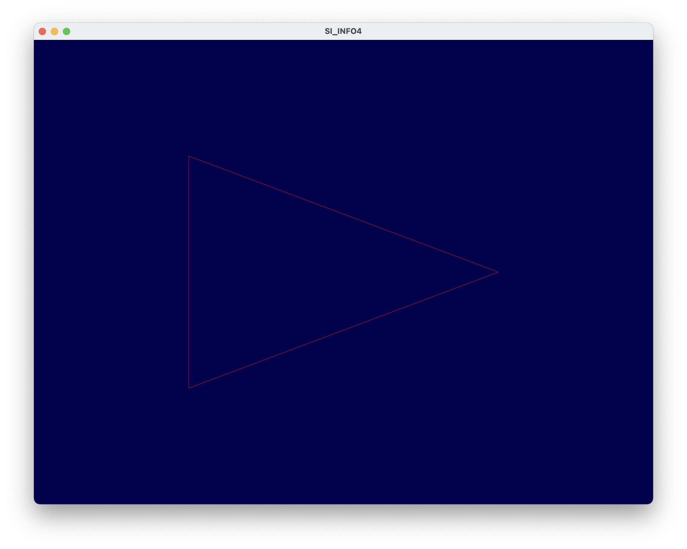
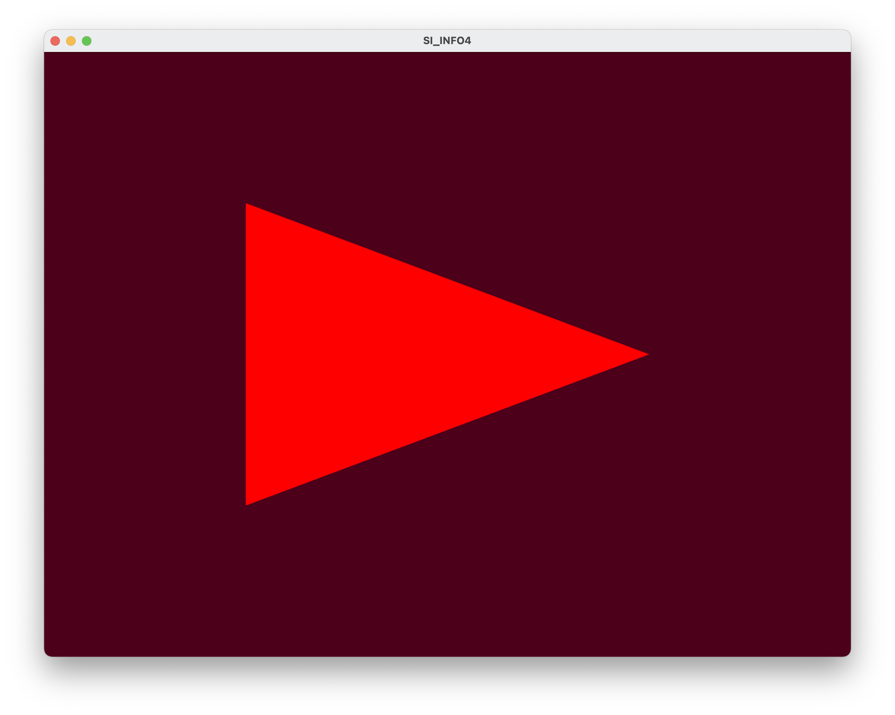
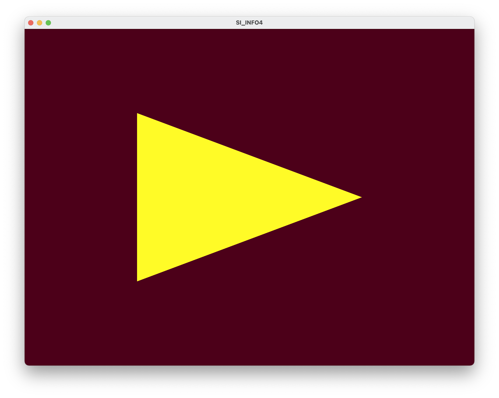
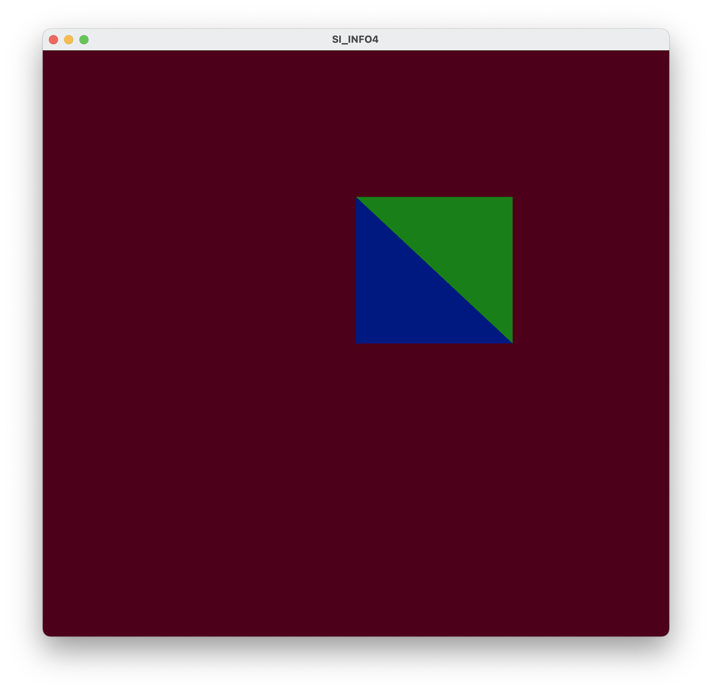
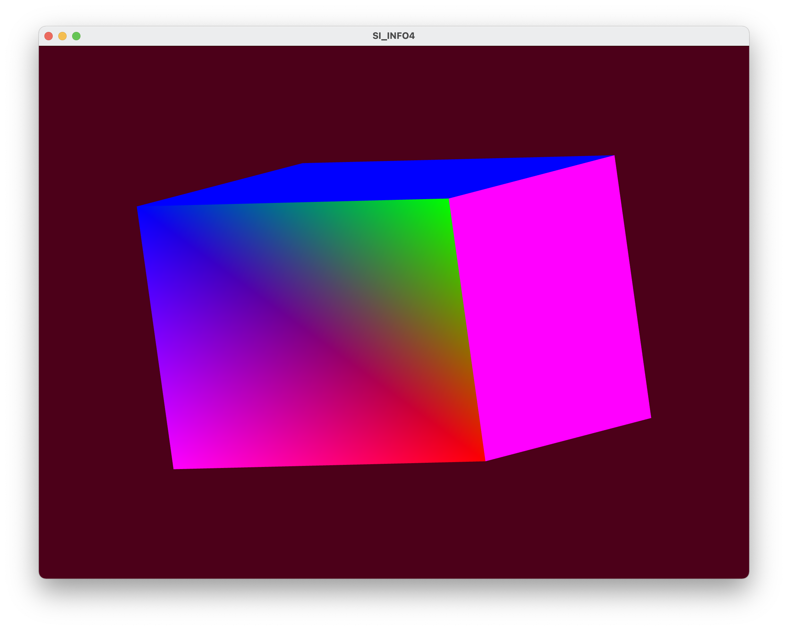
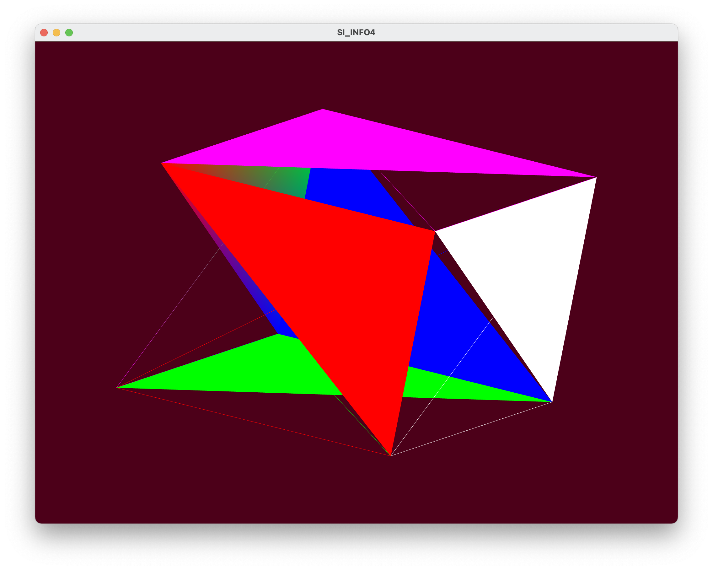
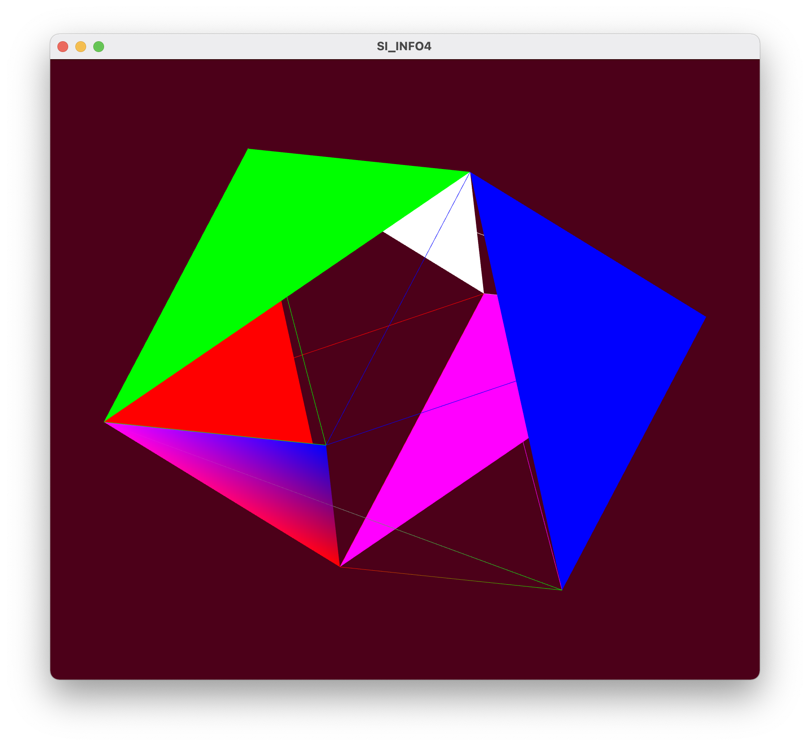

## TP1 - Prise en main d’OpenGL

**Amad Salmon** | **INFO4 - 20/01/2021**

### Dessin d'un triangle en mode immédiat

Dessin d'un triangle en mode immédiat avec `glVertex3f()` puis coloration verte par `glColor3f(0, 125, 0) `inséré avant le dessin du triangle.

```c++
glColor3f(0, 125, 0); 						// Affectation de la couleur verte selon les composantes RGB
glBegin(GL_TRIANGLES); 					  // Début du dessin de la forme, que l'on spécifie ici être un triangle.

/* Création des trois sommets */
glVertex3f(-0.5f, 0.5f, 0.0f);
glVertex3f(0.5f, 0.3f, 0.0f); 	
glVertex3f(-0.5f, -0.5f, 0.0f);

glEnd();													// Fin du dessin de la forme.
```


### Utilisation des shaders

Affectation de la couleur des segments et des sommets par les shaders `shader/fragment.glsl` et `shader/vertex.glsl` :

```c++
// Compilation du shader program et génération de l'ID du Shader
GLuint programID = LoadShaders("../shader/vertex.glsl", "../shader/fragment.glsl");
// Demande d'utiliser le program créé juste au-dessus.
glUseProgram(programID);
```


### Dessin d'un triangle avec un VAO+VBO

On crée un nouveau vertex shader dans le fichier `shader/vvao_vertex_shader.glsl`.

```c++
// Compilation du shader program et generation de l ’ID du Shader
GLuint programID = LoadShaders("../shader/vao_vertex_shader.glsl", "../shader/fragment.glsl");
```

Le triangle ci-dessous a été dessiné à l'aide d'un VAO et d'un VBO à partir du tableau de vecteurs suivant :

```c++
vec3 vertex[3] = {
      vec3(-0.5f, -0.5f, 0.0f),
      vec3(0.5f, -0.0f, 0.0f),
      vec3(-0.5f, 0.5f, 0.0f),
  };
```


<div style="page-break-after: always; break-after: page;"></div>

## À vous de jouer

### Dessin d'un polygone

L'utilisation de la commande `glPolygonMode(GL_FRONT_AND_BACK, GL_LINE)` avant le dessin du triangle fait que seuls les côtés du triangle sont dessinés *(ce contour est très fin, zoomer dans la capture d'écran ci-dessous afin de le remarquer)*. 



<div style="page-break-after: always; break-after: page;"></div>

### Changement de la couleur de fond avec `glClearColor`

Dans l'initialisation de `main.cpp`, afin de donner un couleur bordeaux au fond, on ajoute l'instruction suivante :

```c++
glClearColor(0.3f, 0.0f, 0.1f, 0.0f);
```




<div style="page-break-after: always; break-after: page;"></div>

### Changement de la couleur du triangle dans le fragment shader

Dans le fichier `fragment.glsl`, on remplace la ligne précedemment contenue dans le main par la ligne suivante :

```c++
gl_FragColor = vec4(1.0, 0.9843, 0.1529, 1.0);
```

Cette instruction a pour effet d'affecter la couleur jaune aux fragments dessinés par le fragment shader.



<div style="page-break-after: always; break-after: page;"></div>

### Dessin de différentes formes

### Carré à l’aide de GL_TRIANGLES

Le code ci-dessous permet de dessiner un carré à partir de deux triangles. 

```c++
/* *** DESSIN D'UN CARRÉ À PARTIR DE DEUX TRIANGLES *** */
glBegin(GL_TRIANGLES);

// Triangle inférieur (coloré en bleu)
glVertex3f(0.0f, 0.0f, 0.0f);
glVertex3f(0.5f, 0.0f, 0.0f);
glVertex3f(0.0f, 0.5f, 0.0f);

// Triangle supérieur (coloré en vert)
glVertex3f(0.0f, 0.5f, 0.0f);
glVertex3f(0.5f, 0.5f, 0.0f);
glVertex3f(0.5f, 0.0f, 0.0f);

glEnd();
```

Pour mieux comprendre la construction de cette forme, nous avons, à l'aide de `glColor3f() ` différencié les couleurs des deux triangles. Le résultat est le suivant :




#### Cube à l’aide de GL_POLYGON

Parce que le code nécessaire au dessin d'un cube est très long, nous l'encapsulons dans la fonction `drawCube()` suivante.

```c++
int drawCube()
{
  glClear(GL_COLOR_BUFFER_BIT | GL_DEPTH_BUFFER_BIT);

  // Face avant (multicolore)
  glBegin(GL_POLYGON);
  glColor3f(1.0, 0.0, 0.0);
  glVertex3f(0.5, -0.5, -0.5); // sommet n°1 est rouge
  glColor3f(0.0, 1.0, 0.0);
  glVertex3f(0.5, 0.5, -0.5); // sommet n°2 est bleu
  glColor3f(0.0, 0.0, 1.0);
  glVertex3f(-0.5, 0.5, -0.5); // sommet n°3 est vert
  glColor3f(1.0, 0.0, 1.0);
  glVertex3f(-0.5, -0.5, -0.5); // sommet n°4 est violet
  glEnd();

  // Face arrière (blanc)
  glBegin(GL_POLYGON);
  glColor3f(1.0, 1.0, 1.0);
  glVertex3f(0.5, -0.5, 0.5);
  glVertex3f(0.5, 0.5, 0.5);
  glVertex3f(-0.5, 0.5, 0.5);
  glVertex3f(-0.5, -0.5, 0.5);
  glEnd();

  // Face droite (violet)
  glBegin(GL_POLYGON);
  glColor3f(1.0, 0.0, 1.0);
  glVertex3f(0.5, -0.5, -0.5);
  glVertex3f(0.5, 0.5, -0.5);
  glVertex3f(0.5, 0.5, 0.5);
  glVertex3f(0.5, -0.5, 0.5);
  glEnd();

  // Face gauche (vert)
  glBegin(GL_POLYGON);
  glColor3f(0.0, 1.0, 0.0);
  glVertex3f(-0.5, -0.5, 0.5);
  glVertex3f(-0.5, 0.5, 0.5);
  glVertex3f(-0.5, 0.5, -0.5);
  glVertex3f(-0.5, -0.5, -0.5);
  glEnd();

  // Face supérieure (bleu)
  glBegin(GL_POLYGON);
  glColor3f(0.0, 0.0, 1.0);
  glVertex3f(0.5, 0.5, 0.5);
  glVertex3f(0.5, 0.5, -0.5);
  glVertex3f(-0.5, 0.5, -0.5);
  glVertex3f(-0.5, 0.5, 0.5);
  glEnd();

  // Face inférieure (rouge)
  glBegin(GL_POLYGON);
  glColor3f(1.0, 0.0, 0.0);
  glVertex3f(0.5, -0.5, -0.5);
  glVertex3f(0.5, -0.5, 0.5);
  glVertex3f(-0.5, -0.5, 0.5);
  glVertex3f(-0.5, -0.5, -0.5);
  glEnd();

  glFlush();
  return 0;
}
```

Cette méthode dessine sommet par sommet les faces du cube.   Elle est à appeler dans le `main`, que l'on doit désormais initialiser avec `glEnable(GL_DEPTH_TEST)` afin d'activer le buffer de l'axe Z, l'axe de profondeur.

Afin d'expériementer avec les couleurs d'OpenGL, nous donnons une couleur différente à chaque sommet de la face avant. Le résultat est une face multicolore *(voir capture d'écran ci-dessous)*.



### Différents types de primitives disponibles

Parmi les différentes primitives d'OpenGL disponibles, nous essayons d'appliquer les suivantes grâce à `glBegin(GL_QUAD_STRIP)` :

```
GL_POINTS
GL_LINES
GL_LINE_STRIP
GL_LINE_LOOP
GL_TRIANGLE_STRIP
GL_TRIANGLE_FAN
GL_QUADS
GL_QUAD_STRIP
```

Parmi celles-ci deux retiennent notre attention.

#### GL_TRIANGLE_STRIP

Cette primitive découpe chacune des six faces de notre cube en deux triangles, remplissant l'un et laissant juste le contour de l'autre.



#### GL_QUAD_STRIP

Cette primitive découpe chacune des six faces de notre cube en quatre triangles.



### Quel est l’effet de chaque fonction ?

```c++
/* Dans le main.cpp */
glEnable(GL_VERTEX_PROGRAM_POINT_SIZE);
```

Si cette option est activée et qu'un shader de sommet *(i.e. vertex shader)* est actif, la taille de point `gl_PointSize` est alors prise dans le shader.

```c++
/* Dans le vertex_shader */
gl_Position.x /= 2;
```

Si cette option est activée et que le shader de sommet la contenant est actif, la position des sommets en $x$ est divisée par 2. 


