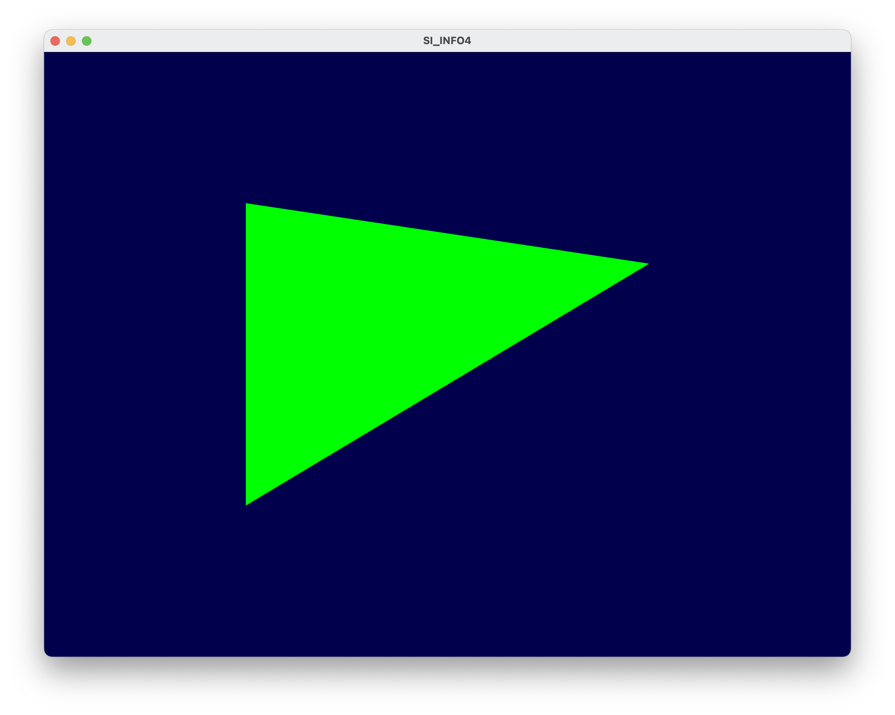

## TP1 - Prise en main d’OpenGL

**Amad Salmon** | **INFO4 - 20/01/2021**

### Dessin d'un triangle en mode immédiat

Dessin d'un triangle en mode immédiat avec `glVertex3f()` puis coloration verte par `glColor3f(0, 125, 0) `inséré avant le dessin du triangle.

```c++
glColor3f(0, 125, 0); 						// Affectation de la couleur verte selon les composantes RGB
glBegin(GL_TRIANGLES); 					  // Début du dessin de la forme, que l'on spécifie ici être un triangle.

/* Création des trois sommets */
glVertex3f(-0.5f, 0.5f, 0.0f);
glVertex3f(0.5f, 0.3f, 0.0f); 	
glVertex3f(-0.5f, -0.5f, 0.0f);

glEnd();													// Fin du dessin de la forme.
```




### Utilisation des shaders

Affectation de la couleur des segments et des sommets par les shaders `shader/fragment.glsl` et `shader/vertex.glsl` :

```c++
// Compilation du shader program et génération de l'ID du Shader
GLuint programID = LoadShaders("../shader/vertex.glsl", "../shader/fragment.glsl");
// Demande d'utiliser le program créé juste au-dessus.
glUseProgram(programID);
```


### Dessin d'un triangle avec un VAO+VBO

Le triangle ci-dessous a été dessiné à l'aide d'un VAO et d'un VBO à partir du tableau de vecteurs suivant :

```c++
vec3 vertex[3] = {
      vec3(-0.5f, -0.5f, 0.0f),
      vec3(0.5f, -0.0f, 0.0f),
      vec3(-0.5f, 0.5f, 0.0f),
  };
```


