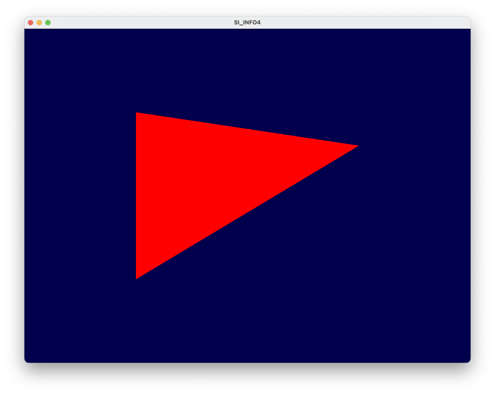

## TP1 - Prise en main d’OpenGL

**Amad Salmon** | **INFO4 - 20/01/2021**

### Dessin d'un triangle en mode immédiat

Dessin d'un triangle en mode immédiat et avec coloration verte par `glColor3f(0, 125, 0) `inséré avant le dessin du triangle.

### Utilisation des shaders

Affectation de la couleur des segments et des sommets par les shaders `shader/fragment.glsl` et `shader/vertex.glsl`.

### Dessin d'un triangle avec un VAO+VBO(s)

