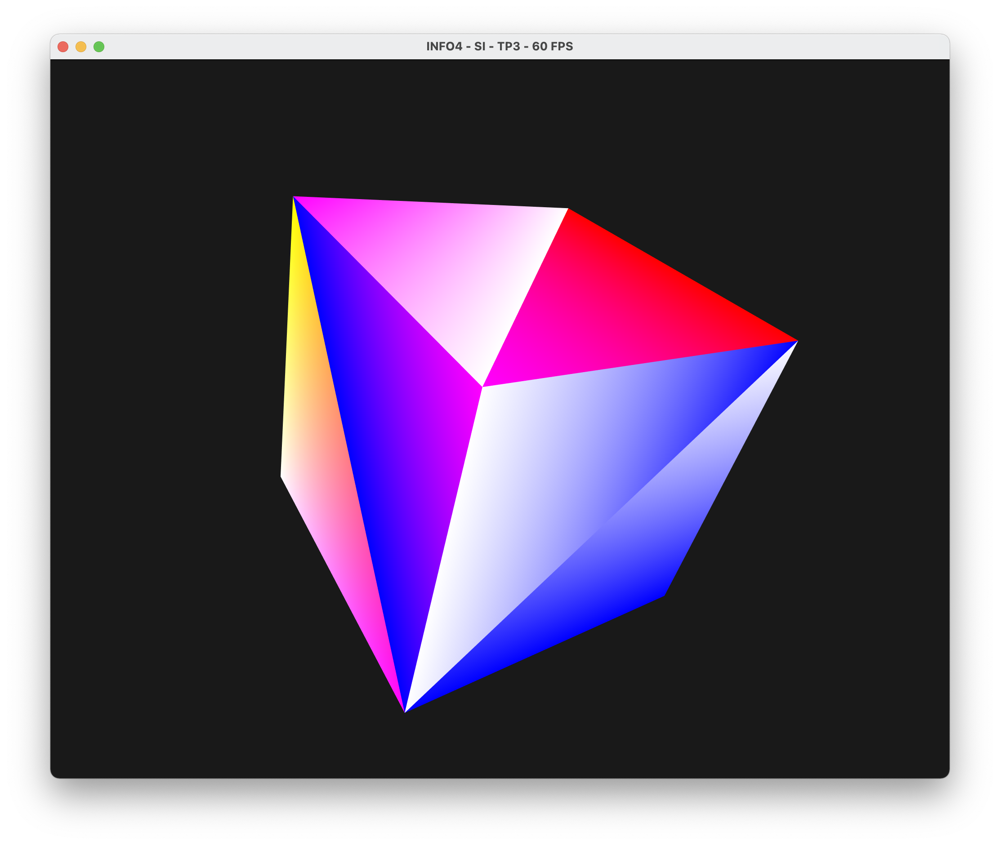

# TP3 - VBO, Maillages et indexation

**Amad Salmon | Synthèse d’Image - Polytech Grenoble, INFO4, 2020-2021**

## Buffer de couleur

Nous créons un tableau de type ```vector<vec3>``` stockant une couleur par sommet du cube,  que  nous  nommons  ```colors```.  Les couleurs sont associées à chacun des sommets de chacune des faces.

Nous créeons ensuite un buffer à partir de ```colors```. Pour ceci, il suffit de faire exactement pareil que pour les positions des sommets ainsi que de modifier le vertex shader pour que celui-ci réceptionne ce nouvel attribut. 

Le résultat est le cube suivant :

