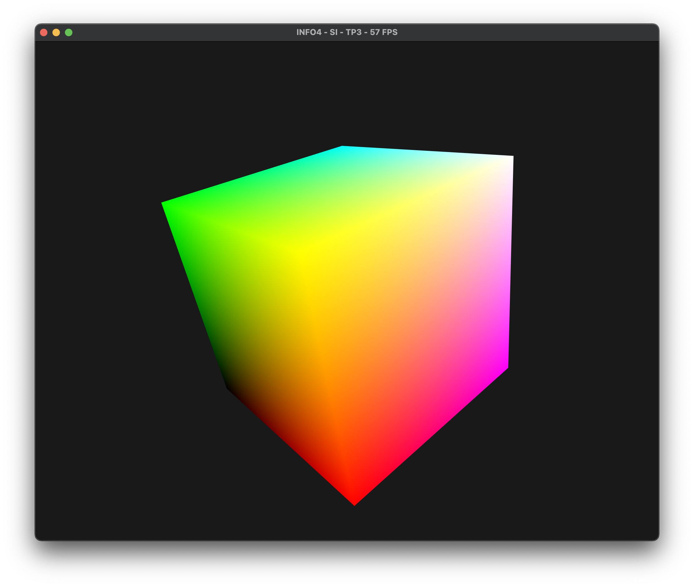
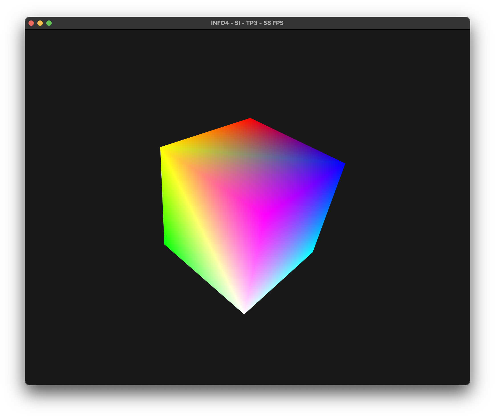
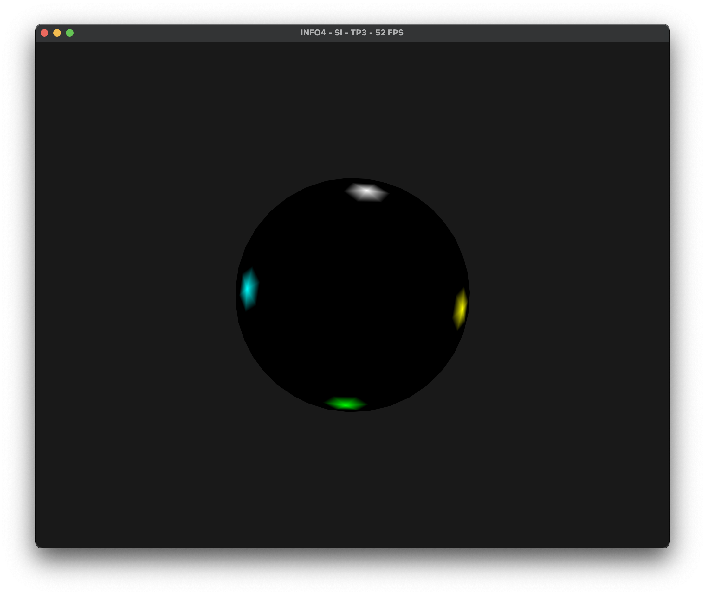

# TP3 - VBO, Maillages et indexation

**Amad Salmon | Synthèse d’Image - Polytech Grenoble, INFO4, 2020-2021**


## Buffer de couleurs

Nous créons un tableau de type ```vector<vec3>``` stockant une couleur par sommet du cube,  que  nous  nommons  ```colors```.  Les couleurs sont associées à chacun des 6 sommets de chacune des 4 faces du cube, c'est à dire qu'il y a donc 36 couleurs dans `colors`.

Nous créeons ensuite un buffer à partir de ```colors```. Pour ceci, il suffit de faire exactement pareil que pour les positions des sommets ainsi que de modifier le vertex shader pour que celui-ci réceptionne ce nouvel attribut. Nous choississons de couleurs totalement aléatoires pour chaque sommet afin d'obtenir un résultat plus intéressant.

Le résultat est le cube suivant :


Comme attendu, ayant choisi des couleurs aléatoires pour chaque sommet, les couleurs ne sont pas homogènes entre les différents triangles adjacents. 


## Buffer d'indices

On créé un buffer d'indices pour les 2 triangles à 3 sommets chacun de chacune des 6 faces de notre cube de la manière suivante : 

```c++
uint lesIndices[] = {
    // Haut
    4, 7, 0,
    3, 4, 0,

    // Bas
    2, 1, 6,
    5, 2, 6,

    // Gauche
    0, 7, 6,
    1, 0, 6,

    // Droite
    4, 3, 2,
    5, 4, 2,

    // Devant
    3, 0, 1,
    2, 3, 1,

    // Derrière
    7, 4, 5,
    6, 7, 5
  };

  vector<uint> indices;
  for (int i = 0; i < 36; i++)
  {
    indices.push_back(lesIndices[i]);
  }
```

L’envoi de ce tableau d'indices au GPU est très similaire à celui des sommets ou des couleurs.

Le résultat est un cube strictement identique au cube généré par le code de base qui utilisait 36 sommets.




<div style="page-break-after: always; break-after: page;"></div>
## Maillage

On charge le maillage `cube.off` du répertoire `models`, voici le résultat :




Par curiosité, on tente de charger d'autres maillages. Voici le résultat (plutôt particulier) pour le maillage `sphere.off` :

