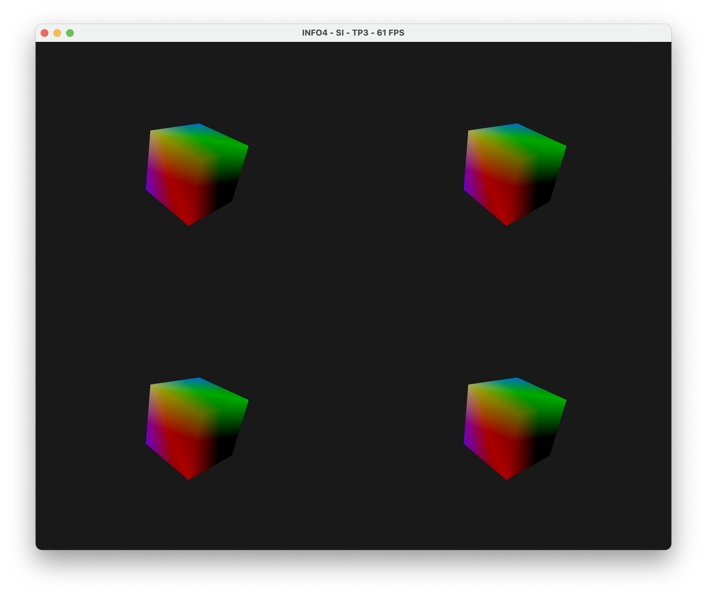
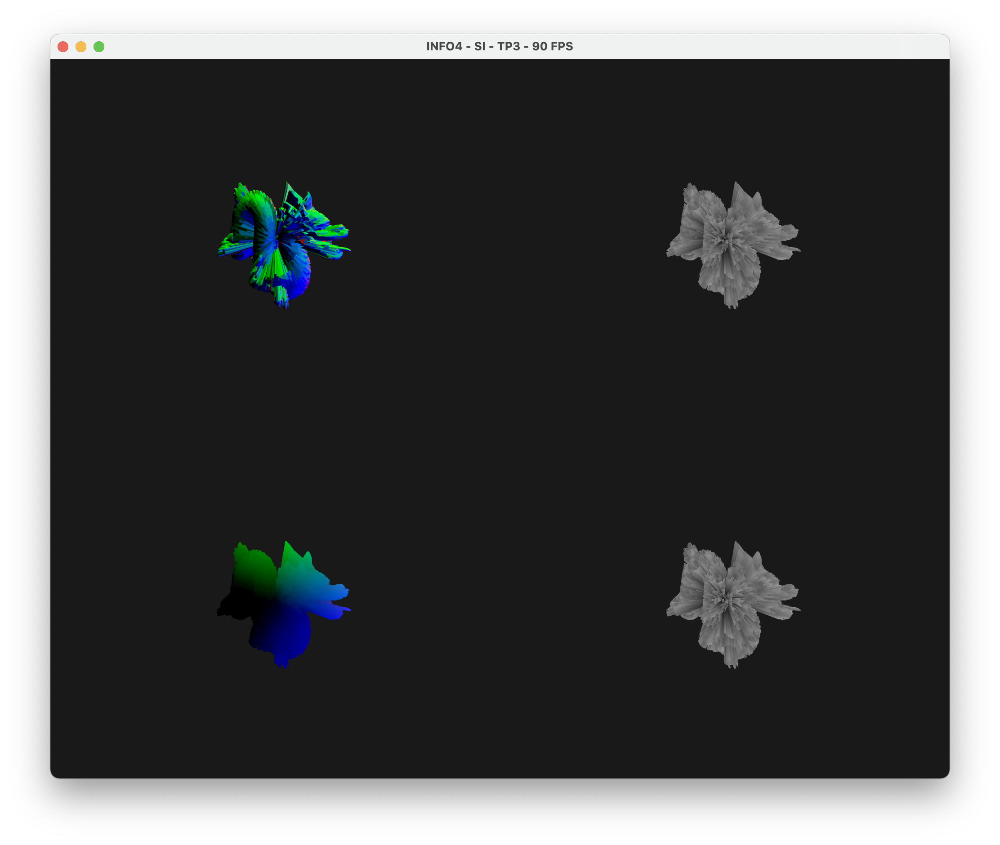
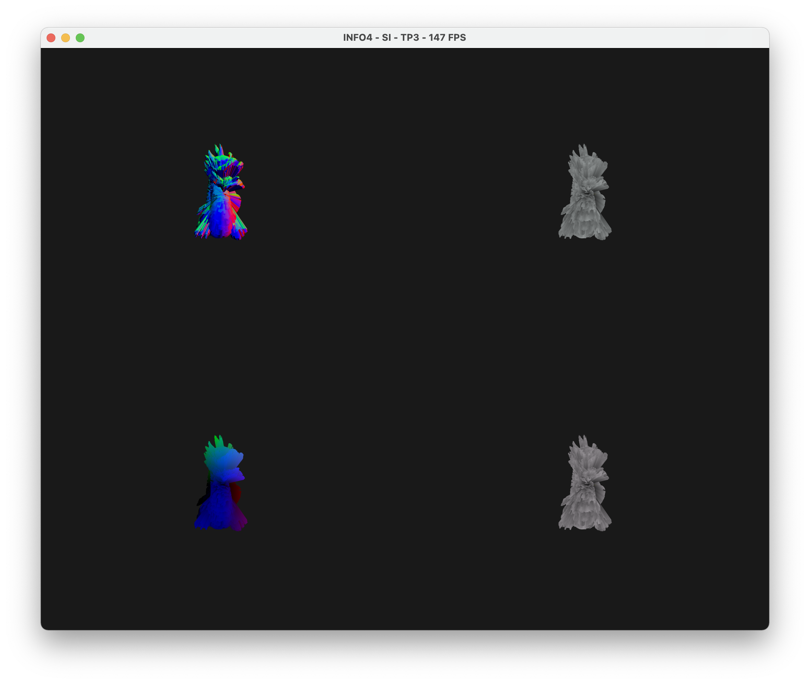
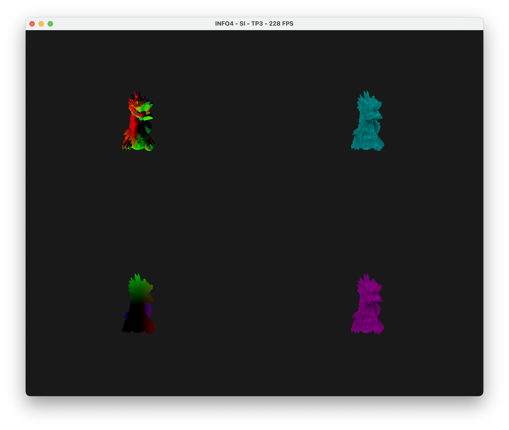

# TP3-bis - VBO, Maillages et indexation

**Amad Salmon | Synthèse d’Image - Polytech Grenoble, INFO4, 2020-2021**

Ce TP poursuit le TP précédent.

## Ajout d'un attribut  
Nous souhaitons ajouter un attribut pour les normales. Nous devons donc procéder en deux étapes.  

Nous initialisons un nouveau buffer dans `main.cpp` :  
```c++
  //==================================================
  // Creation d'un nouveau buffer pour les normales
  //==================================================

  // Creation d'un buffer des normales
  GLuint normalBufferID;
  glGenBuffers(1, &normalBufferID);
  cout << "normalBufferID = " << normalBufferID << endl;

  // Definition de normalBufferID comme le buffer courant
  glBindBuffer(GL_ARRAY_BUFFER, normalBufferID);

  // Copie des donnees sur la carte graphique (dans normalBufferID)
  glBufferData(GL_ARRAY_BUFFER, m.normals.size() * sizeof(vec3), m.normals.data(), GL_STATIC_DRAW);

  // Obtention de l'ID de l'attribut "in_normal" dans programID
  GLuint vertexNormalID = glGetAttribLocation(programID, "in_normal");

  // On autorise et indique a OpenGL comment lire les donnees
  glVertexAttribPointer(vertexNormalID, 3, GL_FLOAT, GL_FALSE, 0, (void *)0);
  glEnableVertexAttribArray(vertexNormalID);

  glBindVertexArray(0); // Désactiver le VAO
```
Puis nous ajoutons un nouvel attribut dans le vertex shader `shader/vertex.glsl` :    
```c++
layout(location=2) in vec3 in_normal; // ajout de cette ligne dans les données d'entrées
my_color = vec4(in_normal, 1.0);
```
 Le maillage contient donc désormais trois buffers d’attributs : positions, normales et couleurs.

## Découpage de la fenêtre en plusieurs zones

La fonction `glViewport()` permet de restreindre la zone de dessin dans la fenêtre courante en quatre sous-fenêtres (qu'on appellera aussi cadrans). 

_(Voir le code de `main.cpp` dans la section suivante)_

Le résultat est le suivant : 



## Envoi de variables uniformes au shader  
On crée une variable uniforme `uniform int ToDraw` dans le vertex shader qui servira à déterminer quel cadran le shader est actuellement appliqué. Cette variable recevra sa valeur grâce à l'appel à `glUniform1i(ToDrawID, N);` où dans la boucle de dessin du `main.cpp` où `N` est le numéro du cadran que nous avons attribué de 1 à 4 dans le sans anti-horaire en commençant par le cadran supérieur droite.  
La boucle de dessin du `main.cpp` devient alors :  
```c++
// Récupération de la taille actuelle de la fenêtre
glfwGetWindowSize(myWindow, &currentWindowWidth, &currentWindowHeight);
    
 // Dessin en haut à droite --------
 glViewport(currentWindowWidth/2, currentWindowHeight/2, currentWindowWidth/2, currentWindowHeight/2);
glUniform1i(ToDrawID, 1); // Modification de la valeur de dessin
glDrawElements(GL_TRIANGLES, m.faces.size(), GL_UNSIGNED_INT, 0);

// Dessin en haut à gauche --------
glViewport(0, currentWindowHeight/2, currentWindowWidth/2, currentWindowHeight/2);
glUniform1i(ToDrawID, 2); // Modification de la valeur de dessin
glDrawElements(GL_TRIANGLES, m.faces.size(), GL_UNSIGNED_INT, 0);

// Dessin en bas à gauche --------
glViewport(0, 0, currentWindowWidth/2, currentWindowHeight/2);
glUniform1i(ToDrawID, 3); // Modification de la valeur de dessin
glDrawElements(GL_TRIANGLES, m.faces.size(), GL_UNSIGNED_INT, 0);

// Dessin en bas à droite --------
glViewport(currentWindowWidth/2, 0, currentWindowWidth/2, currentWindowHeight/2);
glUniform1i(ToDrawID, 4); // Modification de la valeur de dessin
glDrawElements(GL_TRIANGLES, m.faces.size(), GL_UNSIGNED_INT, 0);
```

*Note :* Sur mon ordinateur, les divisions par deux dans les paramètres des appels à la fonction  `glViewport` donne un rendu étrange dont je vous ai parlé par mail, dans lequel la fenêtre est divisée en quatre cadrans, **puis** le dessin est fait dans le cadran inférieur gauche qui est lui même divisé en quatre. 


Dans le vertex shader, nous utilisons un switch statement : 

```c++
switch(ToDraw) {
    case 1: // Dessin en haut à droite --------
      my_color = vec4(in_color, 1.0);
      break;
    case 2: // Dessin en haut à gauche --------
      my_color = vec4(in_normal, 1.0);
      break;
    case 3: // Dessin en bas à gauche --------
      my_color = vec4(in_position, 1.0);
      break;
    case 4: // Dessin en bas à droite --------
      my_color = vec4(in_color, 1.0);
      break;
    default: 
      my_color = vec4(in_color, 1.0);
      break;
  }
```

Le résultat est le suivant pour le maillage `models/dragon.off` :



## Animation

Dans le vertex shader `shader/vertex.glsl`, on rajoute la variable uniforme `uniform float CurrentTime` qui contiendra le temps courant.

```c++
GLuint CurrentTimeID = glGetUniformLocation(programID, "CurrentTime");
cout << "CurrentTimeID = " << CurrentTimeID << endl;
```

Puis dans la boucle de dessin, on envoie la valeur du temps courant `cur_time`au vertex shader : 

```glUniform1(CurrentTimeID, cur_time);```

Ensuite, dans le vertex shader, on rajoute un vecteur `v_anim` qui multipliera les coordonnées des objets dessinés selon `CurrentTime`. Par exemple, nous appliquons la transformation sinusoïdale suivante : 

```c++
v_anim = vec3(sin(CurrentTime), sin(CurrentTime), sin(CurrentTime));
my_color = vec4(v_anim * in_normal, 1.0);
```

Appliquée différemment à chacun des quatre cadrans, cette animation donne alors un rendu qui fluctue entre :



... et :

