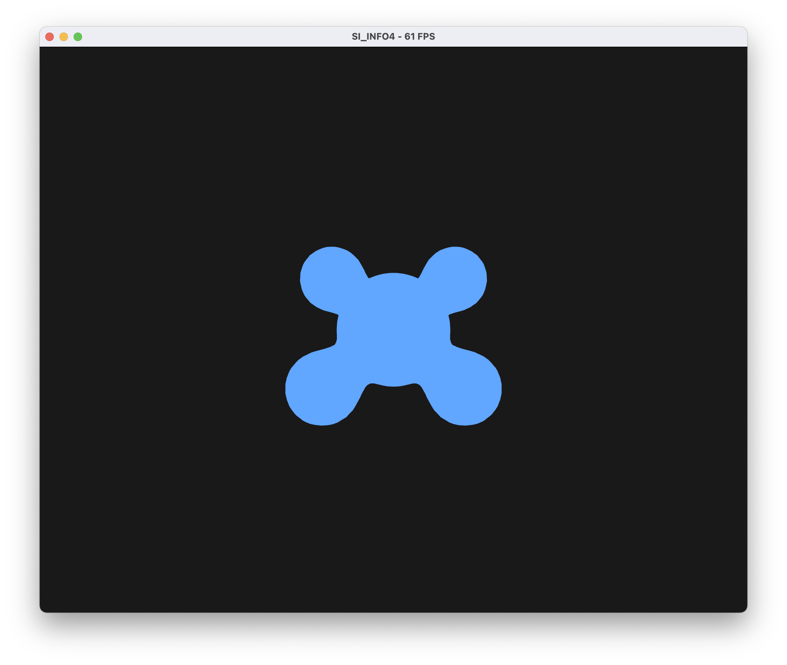
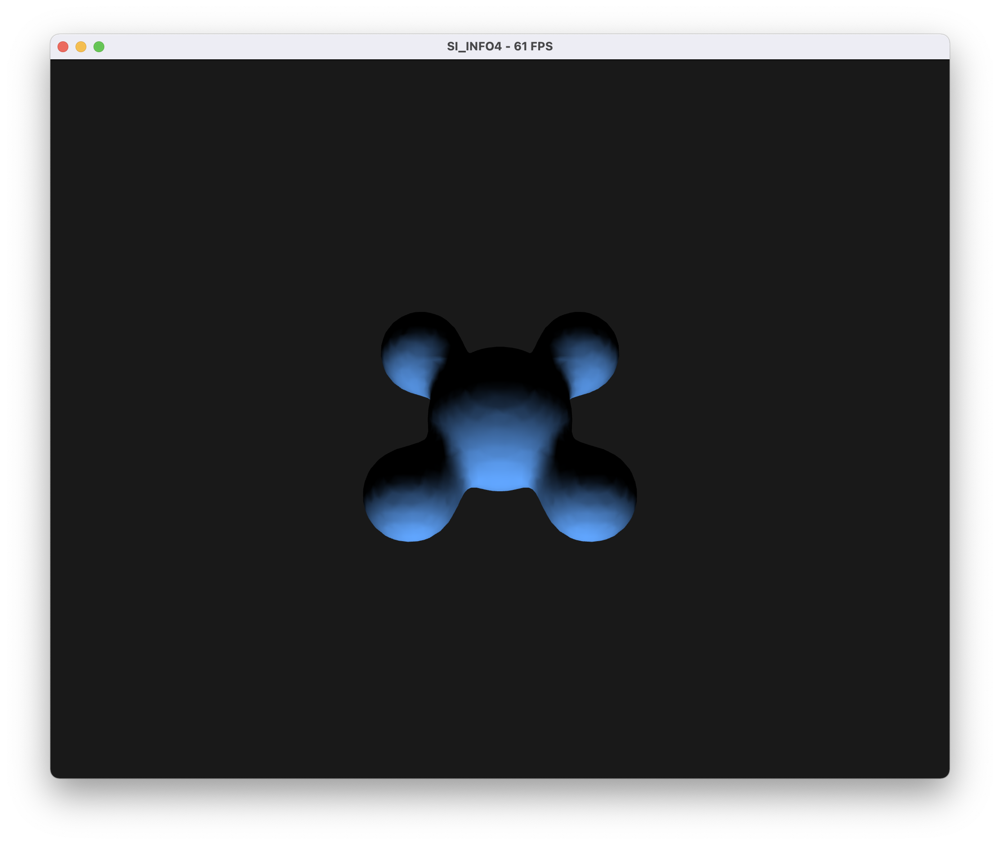
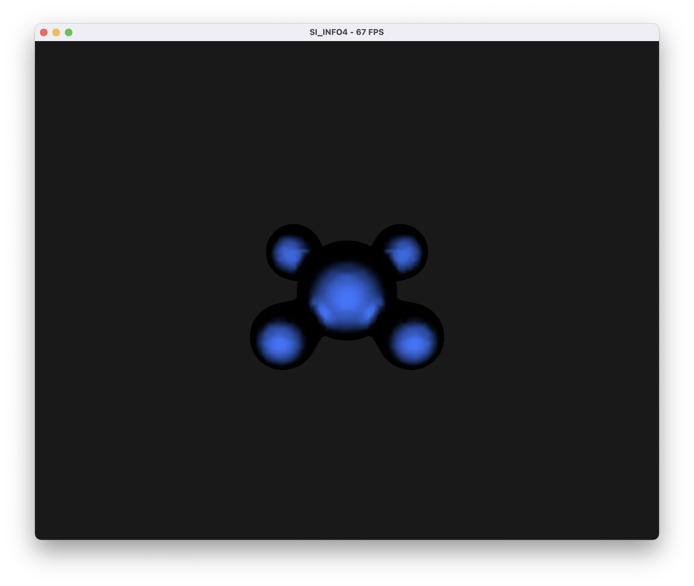
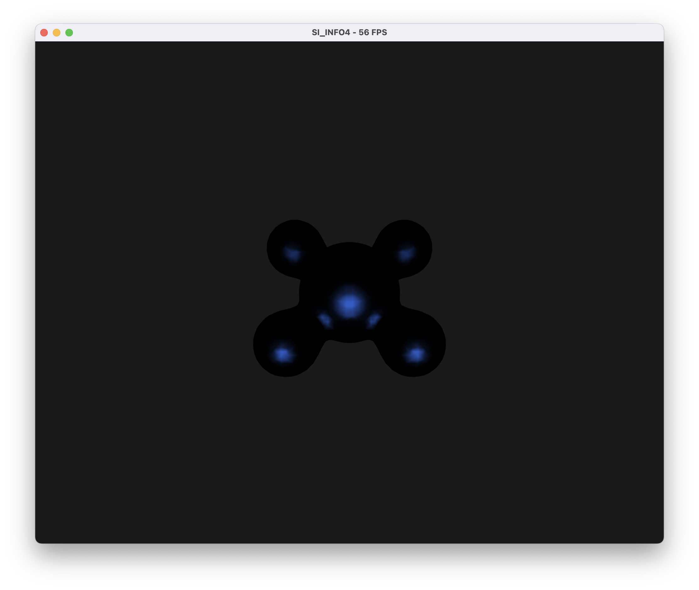
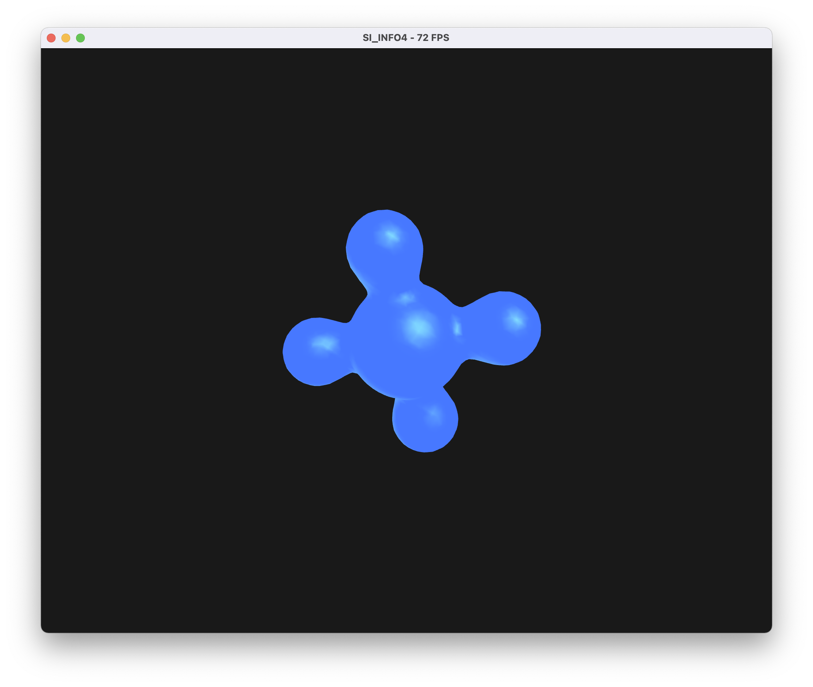

# TP4 - Modèles d'illumination

**Amad Salmon | Synthèse d’Image - Polytech Grenoble, INFO4, 2020-2021**

## Choix d'implémentation

### Choix du modèle d'illumination

Afin de faciliter le passage entre les deux modèles d'illumination et afin d'éviter de devoir changer manuellement le nom des shaders à charger selon le modèle voulu, nous mettons en place une variable `choix_shader` qui peut prendre comme valeur les constantes `SHADING_DE_GOURAUD` ou `SHADING_DE_PHONG`. Selon `choix_shader`, le programme `main.cpp` charge le shader program voulu.  
Par exemple, pour choisir d'illuminer le dessin avec un shader de Phong, il suffit, (ligne 96 du `main.cpp`), d'écrire `int choix_shader = SHADING_DE_GOURAUD;`.

### Nom des variables

| Variable mathématique | Nom dans le code |                                            Fonction                                            |
|:---------------------:|:----------------:|:----------------------------------------------------------------------------------------------:|
|         $L_f$         |       `L_f`      |                            Couleur résultante calculée par le modèle                           |
|        $\rho_a$       |      `rho_a`     |                   Coefficient d'atténuation associé à la composante ambiante                   |
|        $\rho_d$       |      `rho_d`     |                    Coefficient d'atténuation associé à la composante diffuse                   |
|        $\rho_s$       |      `rho_s`     |                  Coefficient d'atténuation associé à la composante spéculaire                  |
|         $L_a$         |       `L_a`      |                                Couleur de la composante ambiante                               |
|         $L_d$         |       `L_d`      |                                Couleur de la composante diffuse                                |
|         $L_s$         |       `L_s`      |                               Couleur de la composante spéculaire                              |
|          $n$          |        `n`       |                             Vecteur normal de la surface au point p                            |
|          $l$          |        `l`       |                        Vecteur de norme  dans la direction de la lumière                       |
|          $r$          |        `r`       |                     Vecteur réflection de l par rapport à n : $r=l-2<n,l>n$                    |
|          $e$          |        `e`       | Vecteur de norme 1 dans la direction entre le point $p$ de la surface et la position $c$ de l'oeil |
|          $s$          |        `s`       |                                     Brillance *(shininess)*                                    |

## Shading de Gouraud

On implémente le shading de Gouraud grâce aux shaders `vertex_gouraud.glsl` et `fragment_gouraud.glsl`.

Mettons $\rho_a=\rho_d=\rho_s=1.0$, $L_a = L_d = L_s$ *(couleur bleutée)*, et une brillance $s=1.0$.  

On affiche la composante ambiante avec `L_f = ambiant = rho_a * L_a`. Le résultat est :  

On affiche la composante diffuse avec `L_f = diffus = rho_d * L_d * max(-dot(n, l), 0.0)`. Le résultat est :  

On affiche la composante spéculaire avec `L_f = speculaire = rho_s * L_s * pow(max(-dot(r, e), 0.0), s)`. Le résultat est :  

En augmentant la brillance à `s = 10.0`, on obtient des tâches de spécularité plus définies :  

En additionnant les trois composantes avec `L_f = ambiant + diffus + speculaire`, on obtient un objet dont le modèle d'illumination suit le module de Gouraud :

## Shading de Phong

On implémente le shading de Phong grâce aux shaders `vertex_phong.glsl` et `fragment_phong.glsl`.

## Flat shading

## Autres effets

### Contrôle de la direction de lumière avec la souris

### Toon shading