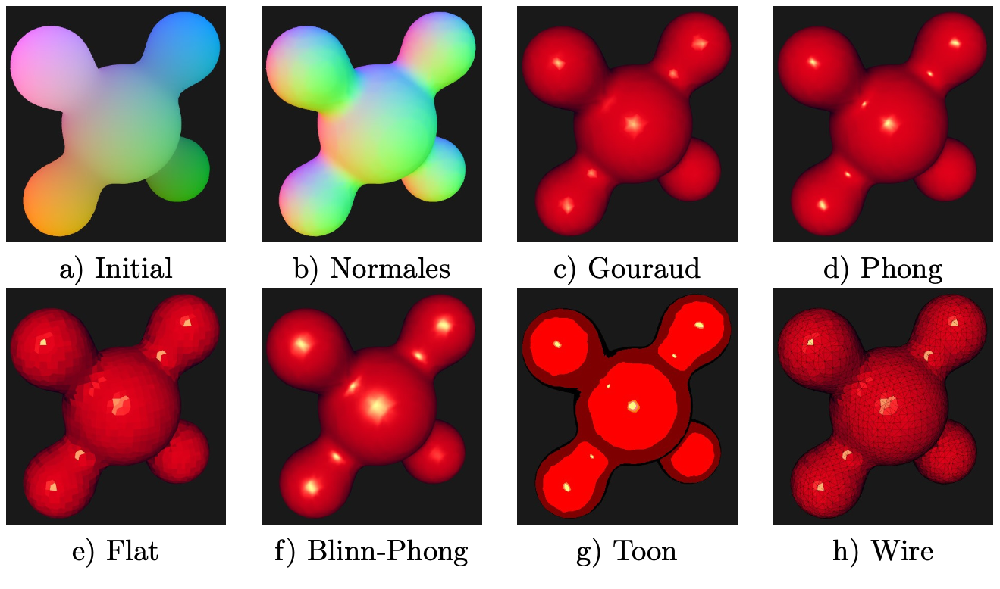
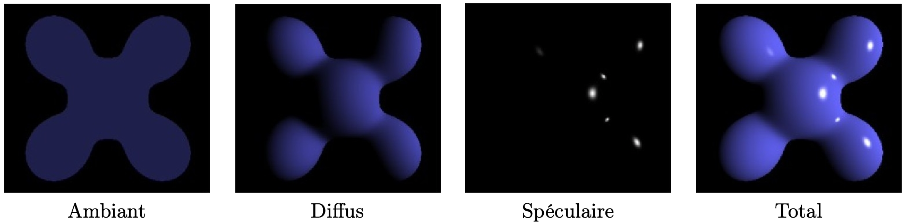
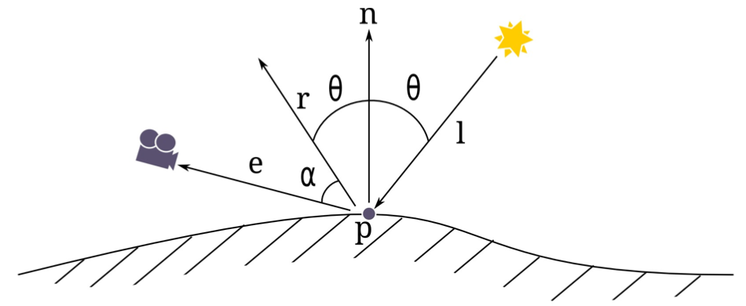

## Synthèse d’Image - Polytech Grenoble, INFO4, 2020-2021 

## TP4 - Shading



## Introduction
L’objectif du TP est d’explorer différentes techniques d’ombrage (shading en anglais) un objet 3D.

La base de code qui vous est fournie reprend les éléments de la dernière séance.
- accédez au dossier des TPs: ```cd ~/TP3D/```
- vérifiez que le répertoire `models`se trouve bien dans `TP3D`, dans le cas contraire reportez vous au sujet du TP1 pour récupérer ce répertoire contenant des modèles 3D.
- récupérez/dézippez le TP4 :

``` 
wget --user="cours_cg" --password="cours_cg" http://www-evasion.imag.fr/~Georges-Pierre.Bonneau/COURS_CG/TP/TP4.zip ;
unzip TP4.zip && rm -f TP4.zip 
```

- placez vous dans le répertoire TP4: ```cd TP4```
- installer un lien vers le répertoire `models` situé dans le repertoire parent:

```
ln -sf ../models .
```

- créez un dossier pour la compilation, accédez à ce dossier, lancez CMake, lancez la compilation
```
mkdir  build ;
cd build ;
cmake .. ;
make ; 
```

Vous pouvez alors exécuter le programme:

```
./si_info4
```

### Modèle local d'illumination de Phong

Un modèle local d’illumination vise à calculer une couleur à partir d’un ensemble de paramètres d’entrée :

- un ensemble de paramètres relatifs à la surface de l’objet :
  - une position dans l’espace
  - une normale à la surface en ce point
  - une couleur de la surface en ce point
  - une BRDF (Bidirectional Reflectance Distribution Function)

- un ensemble de paramètres relatifs à la lumière :
  - une position dans l’espace ou une direction d’illumination
  - une couleur
  - une intensité

Comme son nom l'indique, un modèle local ne tient pas compte des phénomènes globaux tels que les multiples rebonds subis par un rayon lumineux entre une source lumineuse et les objets de la scène, avant d'atteindre l'oeil.

Le modèle d'illumination local le plus simple et le plus répandu est le modèle de *Phong*. Il s’exprime comme la somme de diférentes composantes, comme nous pouvons le voir sur la figure suivante :



Plus précisément le modèle de Phong est donné par l'équation suivante. 

$$ \underbrace{\rho_a . L_a}_{\text{Ambiant}} + \underbrace{\rho_d . L_d . \max(-<\bf{n},\bf{l}>, 0)}_{\text{Diffus}} + \underbrace{\rho_s . L_s . \max(<\bf{r},\bf{e}>, 0)^s}_{\text{Spéculaire}} = \underbrace{L_f}_{\text{Total}}$$

où

- $\rho_a, \rho_d, \rho_s$ sont les coefficients d'atténuation (type ```float```) associés à chaque composante,
- $L_a, L_d, L_s$ sont les couleurs ( type ```vec3```) de chaque composante,
- $L_f$ est la couleur résultante calculée par le modèle de Phong,
- $\bf{n}$ est le vecteur normal de la surface au point $p$,
- $\bf{l}$ est un vecteur de norme $1$ dans la direction de la lumière,
- $\bf{r}$ est le vecteur réflection de $\bf{l}$ par rapport à $\bf{n}$: $\bf{r} = \bf{l} - 2 <\bf{n},\bf{l}> \bf{n}$, en GLSL: ```r = reflect( l, n)```,
- $\bf{e}$ est un vecteur de norme $1$ dans la direction entre le point $p$ de la surface et la position $c$ de l'oeil,
- $s$ est la brillance (shininess en anglais): c'est un nombre réel, souvant puissance de deux, pondérant l'étalement de la tâche spéculaire.

Les vecteurs $\bf{n}, \bf{l}, \bf{e}, \bf{r}$ sont illustrés dans la figure suivante. Comme tous ces vecteurs sont normés, on sait que $\cos{\theta} = -<\bf{n},\bf{l}> = <\bf{r},\bf{l}>$ et $\cos(\alpha) = <\bf{r},\bf{e}>$)



### Shading de Gouraud

Le shading de Gouraud consiste à calculer le modèle local de Phong dans le vertex shader pour chaque sommet d'un maillage.

#### Travail à réaliser :  

Implémentez le shading de Gouraud dans le vertex shader. Vous définirez des variables pour les coefficients d'atténation, les couleurs des différentes composantes, la position de la source lumineuse, la brillance, auxquelles vous attriburez des valeurs vous même. Par exemple la couleur spéculaire $L_s$ est souvent choisie blanche, la couleur diffuse $L_d$ est celle que l'on désigne communément comme "la couleur de l'objet" (rouge, vert...). La couleur ambiante $L_a$ est souvent plus faible, due à un éclairage fictif s'appliquant de manière uniforme en tout point de la surface. 

Faites attention aux points suivants:

- le calcul s'effectue dans le repère monde (world space). Notamment la position du sommet dans le repère monde peut être calculée par:
  ```
  vec4 posInObjectSpace = vec4( in_position, 1.0);
  vec4 posInWorldSpace = ModelMatrix * posInObjectSpace;
  ```
- les normales données en entrée doivent subir une transformation impliquée par le changement de repère entre le repère objet et le repère monde:
  ```vec4 normalInWorldSpace = transpose( inverse( ModelMatrix)) * vec4( in_normal, 0.);```
- pour calculer le vecteur $\bf{e}$ dans le repère monde, vous avez besoin de connaitre la position de la caméra dans ce même repère. Elle peut être calculée par:
  ```
  vec4 cameraPosInWorldSpace = inverse( ViewMatrix) * vec4(0.,0.,0.,1.);
  ```
- pour normaliser un vecteur vous pouvez utiliser la fonction GLSL ```normalize```
- Si ```pos4D``` est un ```vec4``` contenant les coordonnées homogènes d'un point, vous pouvez calculer ses coordonnées cartésiennes ```pos3D``` grâce à: ```vec3 pos3D = pos4D.xyz;```
- pour calculer le produit scalaire de deux vecteurs, vous pouvez utiliser la fonction GLSL `dot`

### Shading de Phong

Pour obtenir un rendu plus lisse, le Shading de Phong consiste à appliquer le modèle d'illumination local de Phong en chaque fragment dans le fragment shader, et plus seulement en chaque sommet comme c'était fait dans le shading de Gouraud. 

#### Travail à réaliser :

Pour mettre en place ce shading vous devrez créer des variables de sorties dans votre vertex shader qui seront également des variables d'entrées dans le fragment shader, comme c'est déjà le cas avec la variable ```my_color``` dans la base de code.  Plus précisément vous devrez créer une variable pour la position dans le repère monde, et une variable pour la normale dans le repère monde. Ces deux variables seront calculées dans le vertex shader puis transmise au fragment shader. Tout le reste du calcul du modèle d'illumination sera ensuite implémenté dans le fragment shader.

### Flat shading

Comme nous l’avons vu précédemment, les normales des sommets sont interpolées lors de la resterisation. Cependant ceci peut avoir un désavantage : lorsqu’on dessine un cube, on souhaiterait dans certains cas voir des arêtes vives, ce qui n’est pas possible avec des normales interpolées. Pour contrer ce phénomène, nous pourrions dupliquer tous les sommets de manière à ce que chaque sommet ne participe qu’à un seul triangle. Ce faisant, nous perdrions l’avantage de l’indexation. Pour empêcher OpenGL d’interpoler les normales (ou n’importe quel autre attribut de sommet), nous disposons du mot-clef ```flat```. Pour l’utiliser, il faut le placer devant la déclaration de l’attribut concerné (devant le ```out``` dans le vertex shader et devant le ```in``` dans le fragment shader).

#### travail à réaliser:
Essayez cette méthode en appliquand le mot-clef ```flat``` lors de la transmission de la position et de la normale entre le vertex shader et le fragment shader

### autres effets (au choix)

Les parties suivantes peuvent être effectuées dans un ordre quelconque et sont optionnelles.

### Contrôle de la direction de lumière et des paramètres avec clavier et souris
Essayez de contrôler la direction de la lumière avec la souris. Il faut pour cela dans le programme ``C++`` récupérer la position de la souris, en déduire une orientation dans l’espace, puis l’envoyer à votre shader sous forme de variable uniforme. Vous pouvez faire la même chose (en utilisant le clavier par exemple) pour contrôler les paramètres de matériaux (comme la brillance).

### Couleur et animation
Vous disposez d’une couleur par sommet. En utilisant les fonctions disponibles dans GLSL, utilisez cette information pour la combiner aux rendus que vous obtenez. Objectif : obtenir un rendu plus original/stylisé/etc.

### Toon Shading
Le principe du toon shading est d’avoir une image qui ressemble à celle qu’on peut voir dans certain dessins. Ce principe a été mis en place avec succès dans certain jeux. Un des principes de base du toon shading consiste à réduire le nombre de couleurs disponible pour l’affichage. Ceci peut être réalisé facilement grâce à un calcul de modulo (cf. fonction mod) dans le fragment shader.
Essayez de trouver comment réaliser cet effet, et essayez différents nombres de niveaux de couleur.

### Création d'un maillage
Vous pouvez facilement créer vos propres maillages à visualiser dans votre programme. Pour ce faire, vous pouvez par exemple utiliser Blender. Une fois votre maillage créé, vous devez l’exporter au format ```OFF```. Cette fonctionnalité n’étant pas active par défaut, il faut aller dans ```File > User Preferences > Addons > Import-Export: OFF format```. Ensuite, une fois votre objet sélectionné faites ```File > Export > OFF Mesh```.

### Rendu en Wire Frame (fil de fer)
Il peut être parfois utile de distinguer clairement les triangles d’un maillage. Pour ce faire, on peut appeller la fonction ```glPolygonMode( GL_FRONT_AND_BACK, GL_LINE );``` avant le dessin.
Essayez. Afin de visualiser les faces et les arêtes, il faut dessiner l’objet deux fois : une fois dans  mode arête et une fois dans le mode face avec ```glPolygonMode( GL_FRONT_AND_BACK, GL_FILL );```. Ceci nécessite également de créer un couple de shaders dédié au rendu des arêtes, sans quoi celles-ci seront de la même couleurs que les faces, et ne seront donc pas visibles!