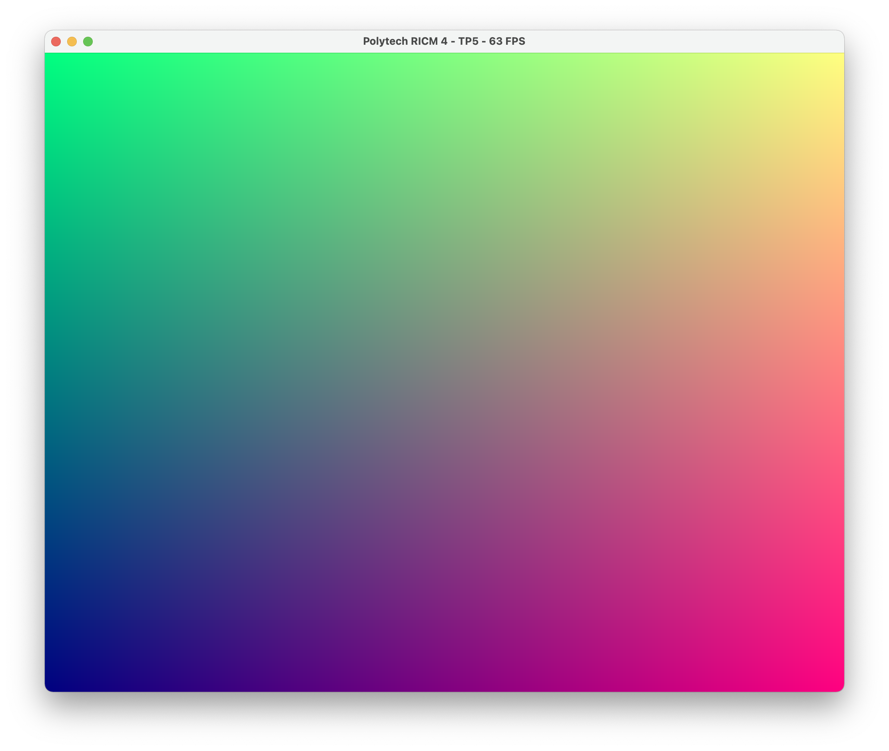
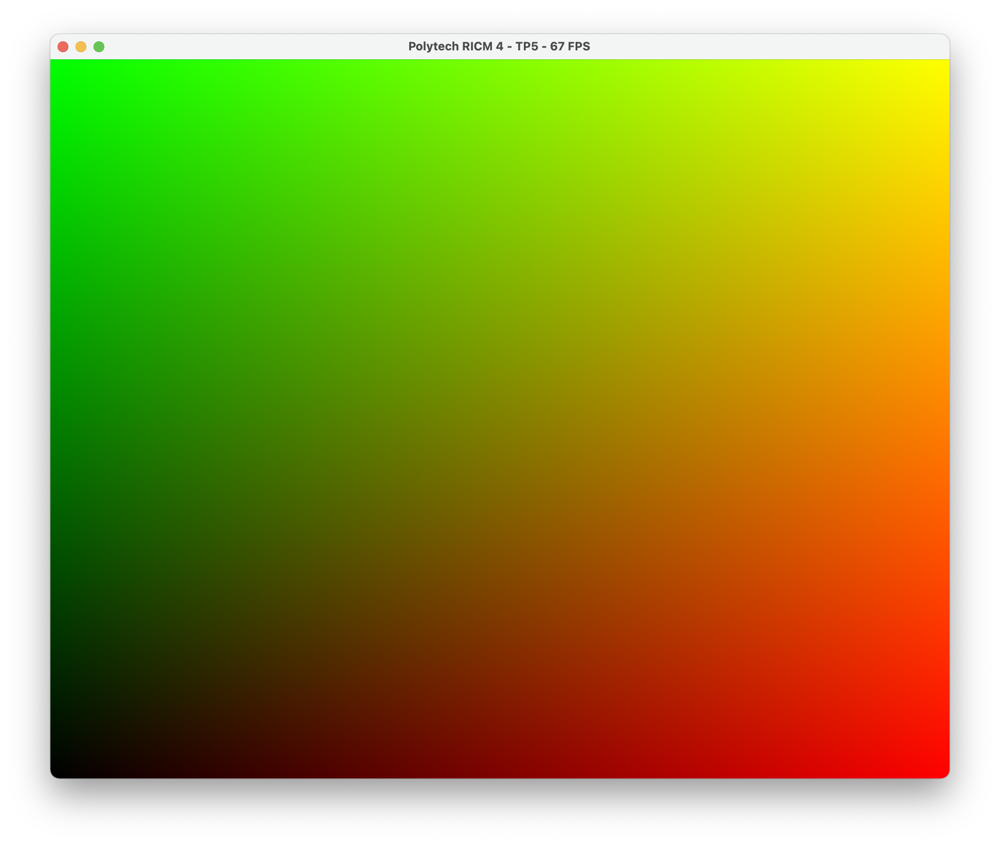
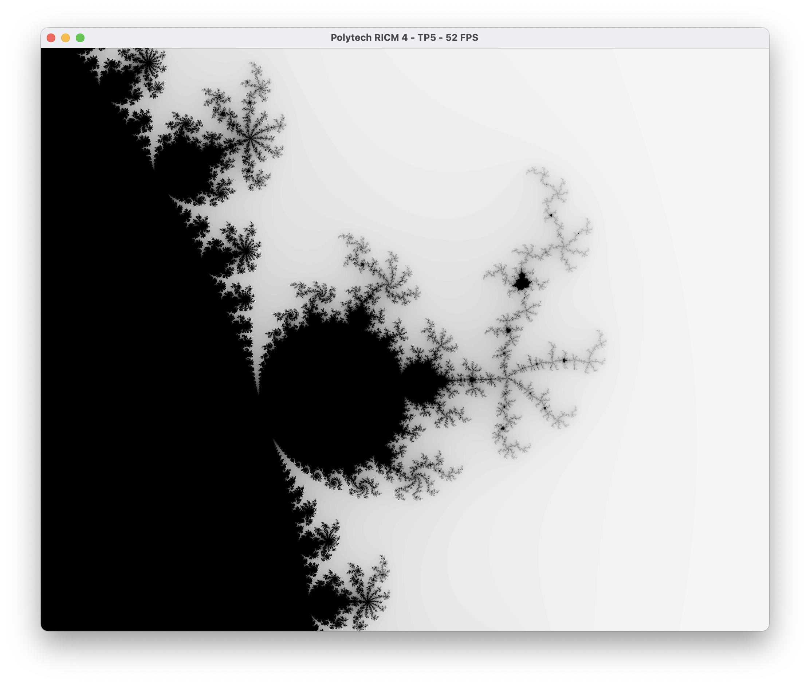
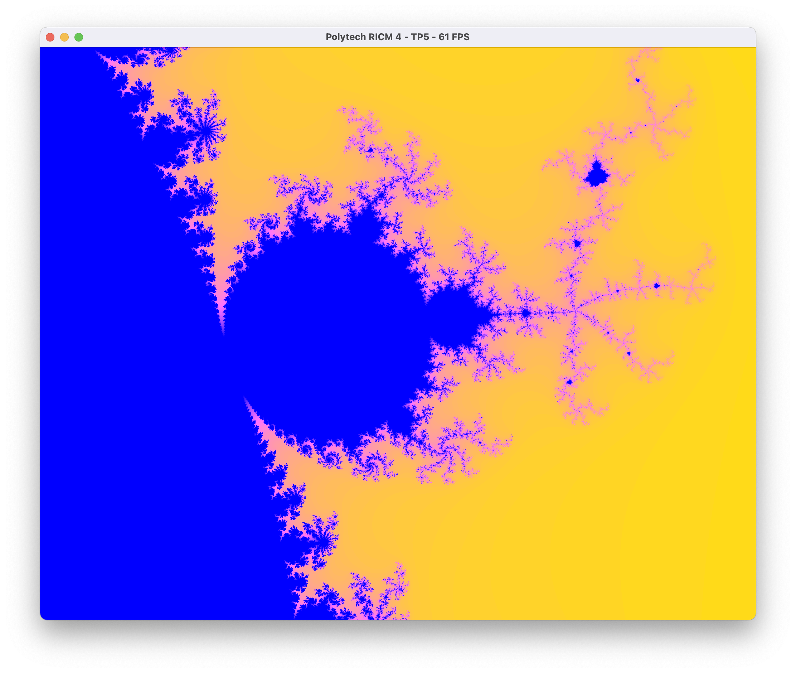
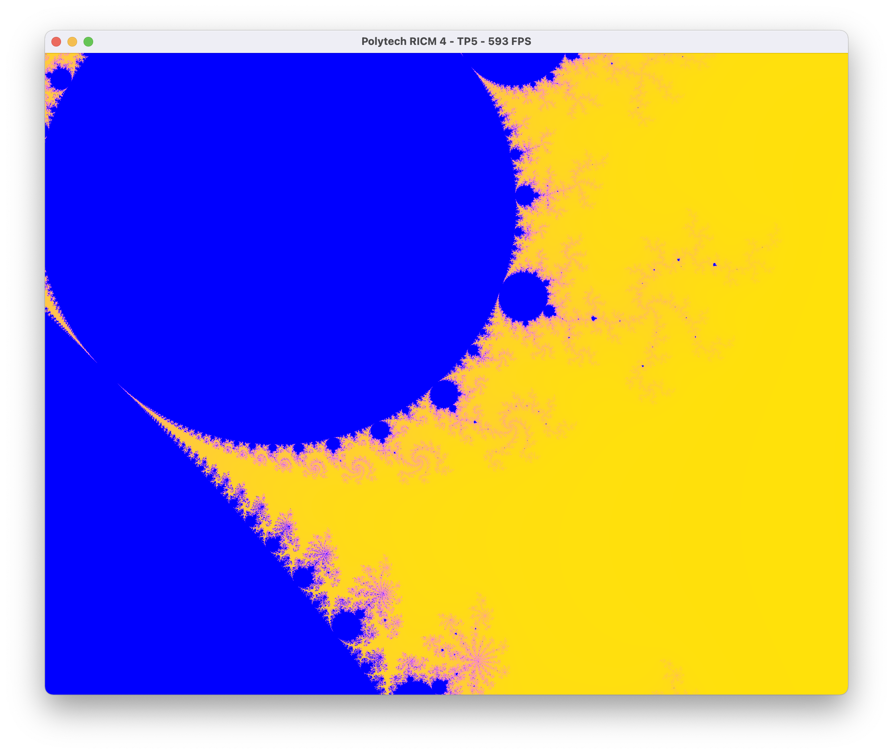
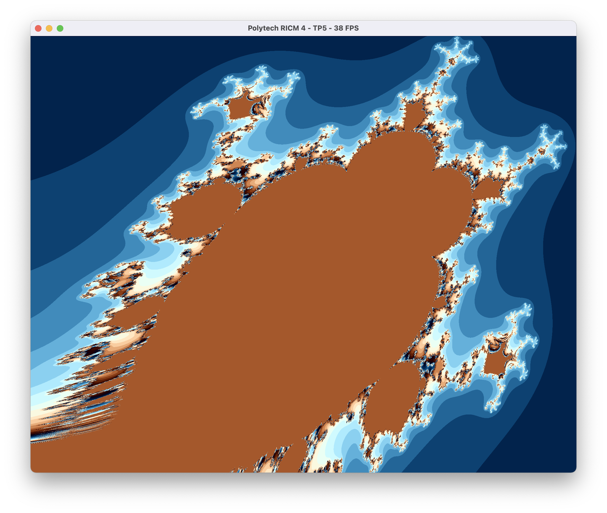
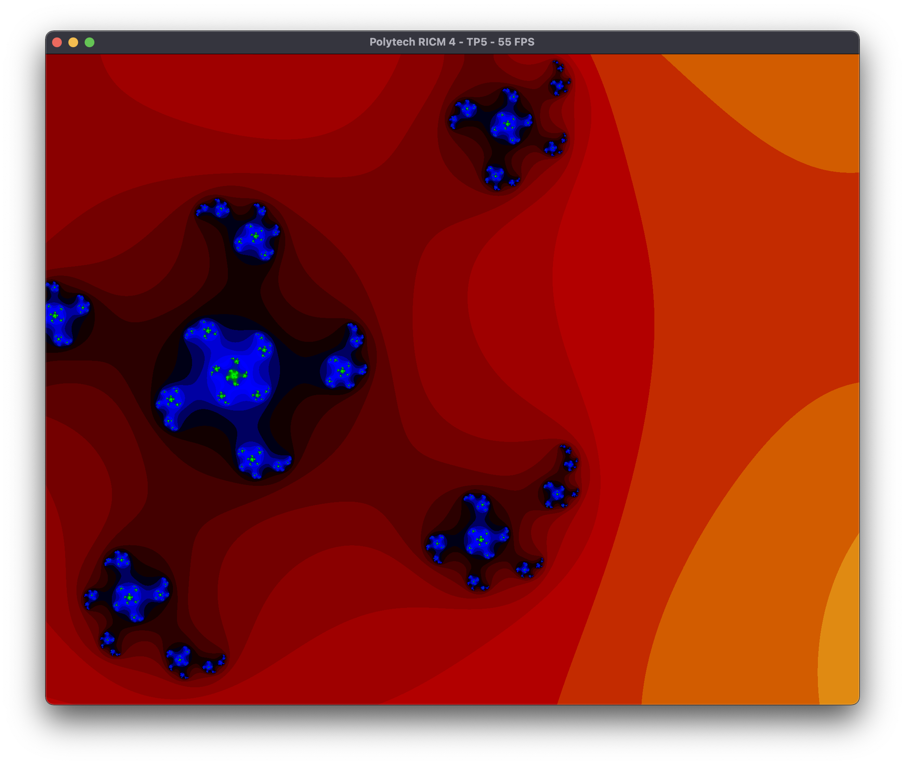
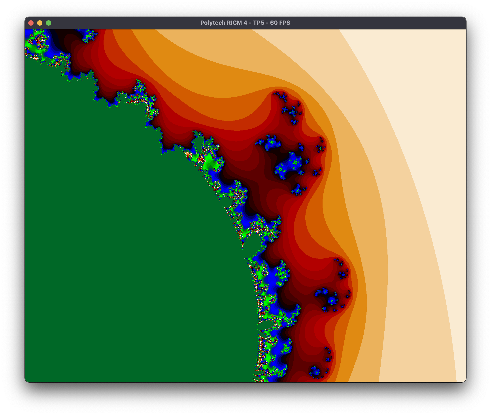

# TP5 - Fragment shader et fractales

**Amad Salmon | Synthèse d’Image - Polytech Grenoble, INFO4, 2020-2021**

## Introduction  
Sans avoir modifié le code initial, on obtient le rendu suivant :


Explication : Le vertex shader exporte pour chaque sommet une variable `coords=(x,y)`, qui correspond aux coordonnées $(x,y)$ de ce sommet dans la fenêtre d'affichage mais dans l'intervalle $[0,1]$. Ensuite, le fragment shader récupère en entrée cette variable `coords=(x,y)`, et s'en sert pour générer les couleurs de chaque sommet. Ainsi, pour le sommet ayant pour coordonnées $(x,y)$ _(dans l'intervalle $[0,1]$)_ aura comme couleur RGB $(x,y,b)$, où $b$ est une constante arbitrairement fixée (ici $b=0.5$).  
Si l'on abaisse $b$ à $0$, autrement dit si on annule la composante bleue, le rendu devient le suivant :  



<div style="page-break-after: always; break-after: page;"></div>
## Fractale de Mandelbrot

On ajoute dans le fragment shader les deux fonctions auxilliaires suivantes :

```c++
/**
 * Retourne un vecteur composé de la partie réelle et de la partie imaginaire 
 * du carré du nombre complexe c.
 */
vec2 raiseComplexNumberToPower2(vec2 c) {
  float real = c.x * c.x - c.y * c.y;
  float imaginary = 2.0 * c.x * c.y;
  return vec2(real, imaginary);
}

/**
 * Retourne le module du nombre complexe c.
 */
float modulusOfComplexNumber(vec2 c) {
  return sqrt(c.x * c.x + c.y * c.y);
}

On implémente `colormap()` avec comme paramètre supplémentaire l entier supplémentaire `modeDeColoration` qui peut prendre comme valeur 1, 2, ou 3 afin d'afficher différentes couleurs.

​```c++
/**
 * Calcule une couleur selon l'ensemble de Mandelbrot
 * à partir des entiers S (valeur seuil) et N,
 * ainsi que du nombre complexe c contenant la position
 * du point à colorier.
 */
 vec4 colormap(float k, int modeDeColoration){
  switch (modeDeColoration) {
    case 1:   // coloration en nuances de gris
      return vec4(1-k, 1-k, 1-k, 1.0);
    case 2:   // coloration complexe
      return vec4(cos(k * 10.0), cos(k * 20.0), cos(k * 30.0), 1.0);
    case 3:   // coloration animée en fonction du temps 
      return vec4(cos(currentTime*K)/currentTime, 1-(K*cos(currentTime)), sin(currentTime*K), 1.0);
    default:
      return vec4(k, k, 1-k, 1.0);
  }
}
```

Afin d'implémenter l'algorithme de l'ensemble de Mandelbrot, on crée une fonction `mandelbrotSet(int N, int S)` qui retourne le résulat *(flottant)* de l'algorithme.

```c++
float mandelbrotSet(int N, int S) {
  vec2 z = vec2(0.0, 0.0);
  int i;
  for(i = 0 ; i < N ; i++){
    z = raiseComplexNumberToPower2(z) + coords.xy;
    if(modulusOfComplexNumber(z) > S) break;
  }

  return 1.0 * i / N;
}
```

Le `main()` devient alors :

```c++
void main() {

  int N = 100;  // nombre maximum d'itérations
  int S = 2;    // Valeur seuil

  float res = mandelbrotSet(N, S);

  // Affichage de la coordonnee du fragment/pixel
  frag_color = colormap(res, 2);
}
```

Pour `modeDeColoration=1`, `N=100`, et `S=2`, le rendu est alors :


En modifiant la fonction de mapping de couleurs et en zoomant un peu *(c.f. paragraphe "Contrôle de la caméra")*, on aperçoit plus de détails : 

Pour `N=100` et `S=2`, le rendu est alors :


En modifiant `N=500` et `S=100`, le rendu devient :



<div style="page-break-after: always; break-after: page;"></div>

### Variantes

#### Ensemble de Mandelbrot d'ordre $k$

Afin d'élever $z$=`c` à la puissance $n$=`N`, on implémente la fonction suivante : 

```c++
vec2 raiseComplexNumberToPowerN(vec2 c, int N) {
  if (N < 0 ) {
      return vec2(0, 0);
  }
  float r = modulusOfComplexNumber(c);
  float t = atan(c.x , c.y);
  float real = pow(r, N) * cos(N*t);
  float imaginary = pow(r, N) * sin(N*t);
  return vec2(real, imaginary);
}
```

Explication :  
Soit $z = a + ib$ avec $a$ et $b$ réels.
On peut noter  $z = a + ib = r*(\cos(\theta) + i\sin(\theta))$,
où $r^2 = a^2 + b^2$, et $\tan(\theta) = b / a$. Alors,  
$$
z^n = (a+ib)^n \\
    = r^n  (\cos(n\theta) + i  \sin(n\theta)) \\
    = r^n  \cos(n\theta)  +  i  r^n  \sin(n\theta) \\
    =    \Re(z^n)     +     i \times \Im(z^n)
$$
On comprend donc que `raiseComplexNumberToPowerN(z,n)` retourne alors un vecteur à deux dimensions contenant $\Re(z^n)$ et $\Im(z^n)$.  

En élevant $z$ à la puissance 5, on obtient le rendu suivant (coloration 2):



<div style="page-break-after: always; break-after: page;"></div>

#### Ensemble de Julia

Afin d'implémenter l'algorithme de l'ensemble de Julia, on crée une fonction `JuliaSet(int N, int S)` qui retourne le résulat *(flottant)* de l'algorithme.

```c++
float juliaSet(int N, int S) {
  vec2 z = coords;
  int i;
  for(i = 0 ; i < N ; i++){
    z = raiseComplexNumberToPower2(z) + vec2(0.5, 0.5);
    if(modulusOfComplexNumber(z) > S) break;
  }

  return 1.0 * i / N;
}
```

Pour le mode de coloration 2, `N=100` et `S=2`, le rendu pour l'ensemble de Julia est le suivant :



<div style="page-break-after: always; break-after: page;"></div>

### Contrôle de la caméra

On implémente le contrôle de la caméra grâce aux techniques précédemment vues au TP2. Ainsi, on modifie la matrice de vue pour les translations mais aussi pour les zooms. *(voir fonction `view_control()` dans le `main.cpp`).*

### Animation

#### Animation de $z_0$

Afin d'implémenter l'animation à l'algorithme de l'ensemble de Mandelbrot, on crée la fonction `mandelbrotSetAnimated(int N, int S)` qui retourne le résulat *(flottant)* de l'algorithme tout en variant $z_0$ en fonction du temps `currentTime`.

```c++
float mandelbrotSetAnimated(int N, int S) {
  vec2 z = vec2(currentTime/50,currentTime/50);
  int i;
  for(i = 0 ; i < N ; i++){
    z = raiseComplexNumberToPower2(z) + coords.xy;
    if(modulusOfComplexNumber(z) > S) break;
  }
  return 1.0 * i / N;
}
```

Le rendu semble éventuellement séparer l'ensemble en îlots :  


#### Animation du mapping de couleur

On implémente l'animation du mapping de couleur en fonction du temps dans le mode 3 de la fonction `colormap()`. Cette animation se fait grâce à des cosinus et des sinus : `vec4(cos(currentTime*k)/currentTime, 1-(k*cos(currentTime)), sin(currentTime*k), 1.0)`.
