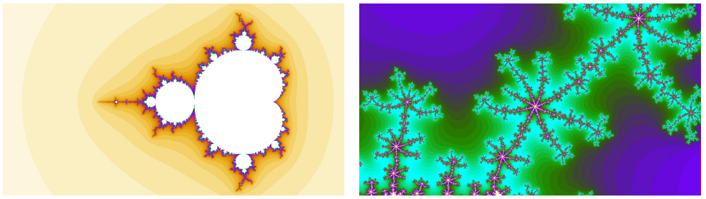

# TP5 - Fragment shader et fractales
**Synthèse d’Image - Polytech Grenoble, INFO4, 2020-2021**



## Compilation

L'objectif du TP est d'apprendre à utiliser le fragment shader pour calculer des images complexes.

Si ce n'est pas déjà fait, placez la base de code dans votre dossier ```TP3D``` contenant les TPs.

- accédez au dossier des TPs: ```cd ~/TP3D/```
- placez vous dans le répertoire TP5: ```cd TP5```
- créez un dossier pour la compilation, accédez à ce dossier, lancez CMake, lancez la compilation
  
  ```bash
  mkdir build
  cd build
  cmake ..
  make
  ```

Vous pouvez alors exécuter le programme:

```bash
./si_info4
```

## Introduction

Prenez la peine de regarder le code source ainsi que les shaders du programme qui vous est donné. Notez l'absence de vertex buffer. Que visualise-t-on dans la fenêtre ? Comment sont transmises les positions des sommets ? À quoi correspond la couleur affichée à l'écran ?

## Fractale de Mandelbrot

Une fractale est une image qui se répète en elle-même: une sous-partie de l'image contient l'image toute entière. De manière concrète, une image fractale peut se calculer grâce à une procédure itérative. Une telle image n'a pas d'utilité pratique évidente, mais est relativement couteuse à calculer. Les cartes graphiques permettent d'effectuer de nombreux calculs en parallèle, et le calcul d'image fractale en temps réel constitue un bon moyen de le constater. Par ailleurs, la mise en place du programme de calcul et d'affichage va nous permettre de prendre en main la partie "fragment shader" d'OpenGL.

#### Procédure

Une des fractales les plus emblématiques est connue sous le nom d'ensemble de Mandelbrot. Un nombre complexe $c$ fait partie de l'ensemble de Mandelbrot ssi la suite complexe $(z_n)$ définie récursivement par:

$$ \begin{cases} z_0=0 \\ z_{n+1} = z_n^2 + c \end{cases}$$

ne diverge pas lorsque $n$ tend vers l'infini.

En pratique, pour calculer l'image, on fait correspondre à chaque pixel $p$ un complexe $c_p$ dont la partie réelle et la partie imaginaire sont déterminées respectivement par la coordonnée horizontale et verticale du pixel. Puis il faut affecter une couleur à ce pixel en fonction d'un critère déterminant la convergence de $z_n$. On se donne pour cela une valeur seuil $S$.  
Si pour un entier $n < N$ donné on constate que $|| z_n || > S$, alors on estime que la suite a divergé et on affecte alors au pixel $p$ une couleur dépendante de $n$.  
Sinon, on estime que la suite n'a pas divergé, et on affecte au pixel $p$ une couleur par défaut.  
Le pseudo code est donc le suivant:
```
z = 0
pour n allant de 0 à N:
  z = z * z + c
  si |z| > S:
    stop boucle
couleur(p) = colormap(n) 
```

### Travail à faire

Pour calculer une image fractale il vous faut, dans le fragment shader:

- créer une fonction calculant le carré d'un nombre complexe (note: un nombre complexe sera représenté par un ```vec2```)
- créer une fonction de calcul de la couleur à partir d'un nombre entier (```colormap```)
- implémenter l'algorithme ci-dessus

## Variantes

Différentes variantes de l'ensemble de Mandelbrot existent. Vous pouvez tester les alternatives suivantes:
- changer la formule de récurrence par: $z_{n+1} = z_n^k + c$ (ensemble de Mandelbrot d'ordre $k$)
- calculer $z_0$ en fonction du pixel $p$, $c$ étant maintenant une constante indépendante du pixel (ensemble de Julia)
- ces variantes et bien d'autres sont consultables sur le site <http://www.shadertoy.com>

### Travail à faire

#### Contrôle de la caméra

Afin de pouvoir vous déplacer dans l'ensemble de Mandelbrot, vous pouvez calculer le nombre complexe $c$ associé au pixel $p$ de manière à prendre en compte un déplacement ou un zoom. Mettez en place un système de contrôle de la vue avec les flèches en vous inspirant de l'interface du ```TP2```. Pour ceci, vous pouvez par exemple déclarer dans le programme C++ deux variables globales représentant les positions des coins supérieur gauche $p_0$ et inférieur droit $p_1$. A l'initialisation du programme, vous aurez $p_0=(0,0)$ et $p_1=(1,1)$. En passant ces deux variables au fragment shader par l'intermédiaire de variables uniformes, vous pouvez calculer dans le fragment shader la position de $p$ relativement au rectangle défini par $p_0$ et $p_1$, par $p = p_0+\text{coords} * (p_1 - p_0)$. Ensuite il ne vous reste plus, dans le programme C++ cette fois, qu'à relier l'appui sur des touches du clavier (les flèches par exemple) à la modification de $p_0$ et $p_1$ : les translater pour déplacer la caméra, ou bien les rapprocher l'un de l'autre pour zoomer. Ainsi les pixels calculés par le fragment shader balaieront le rectangle de coins $p_0$ et $p_1$ plutôt que le carré unité.

#### Animation

En passant une variable uniforme représentant le temps, il est facile de créer une animation dans le shader. Il faut pour ceci faire varier un paramètre de l'algorithme (comme par exemple $z_0$, ou le mapping de couleur) en fonction de la variable représentant le temps.