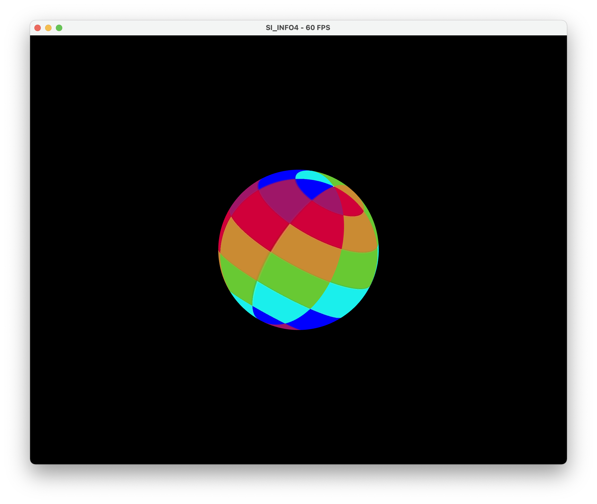
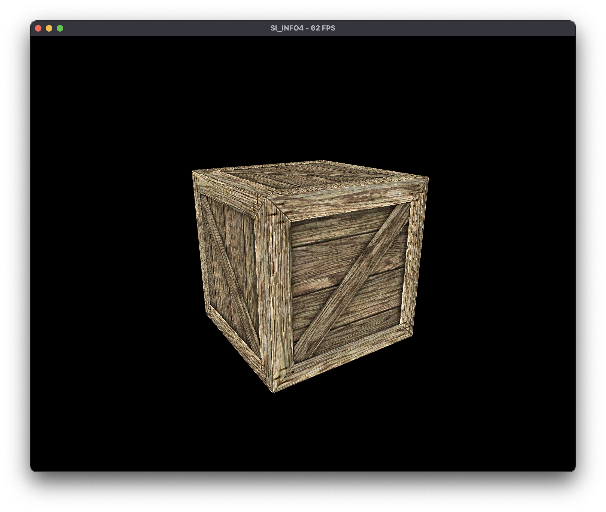
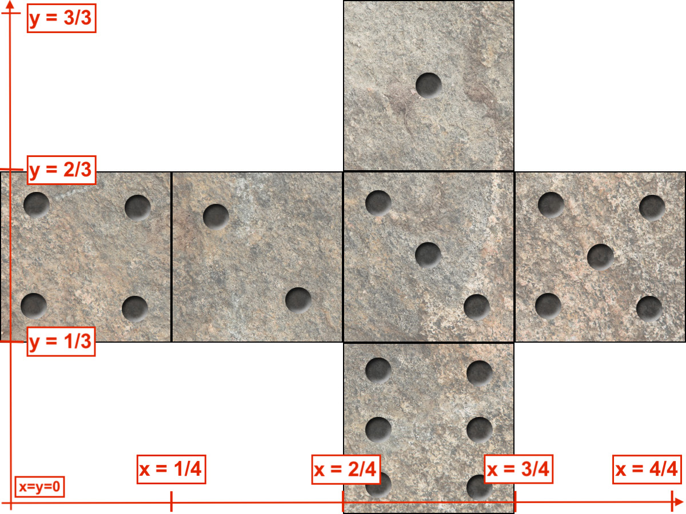
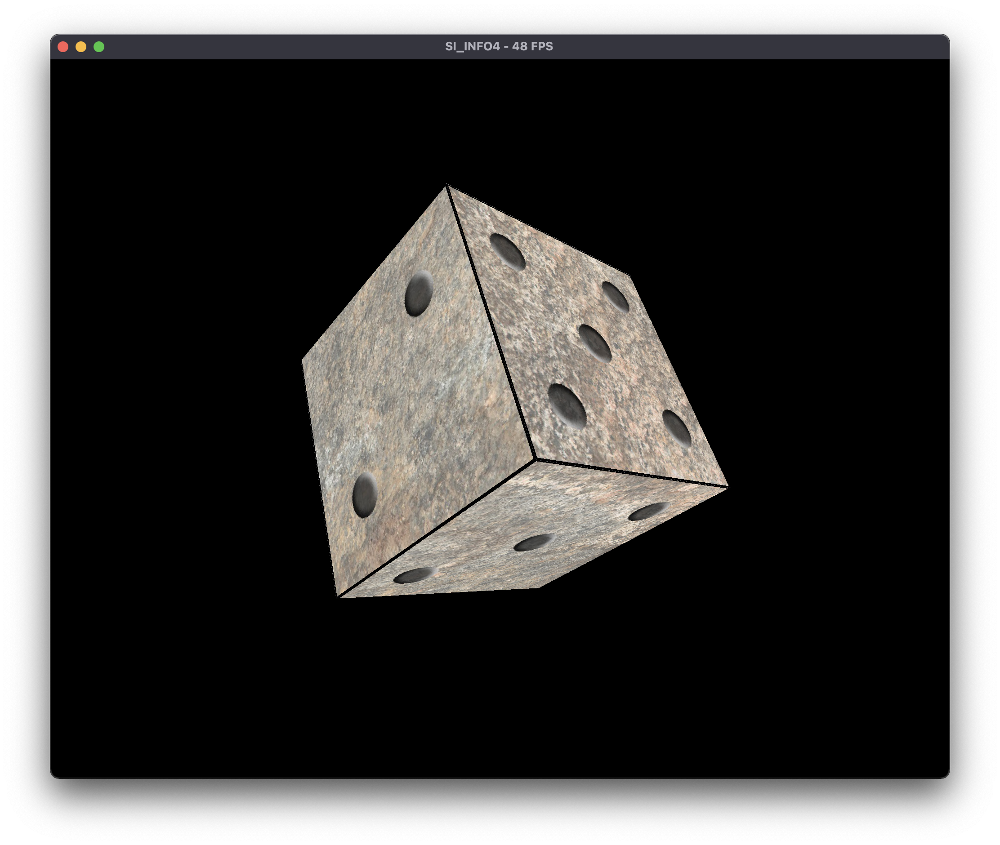
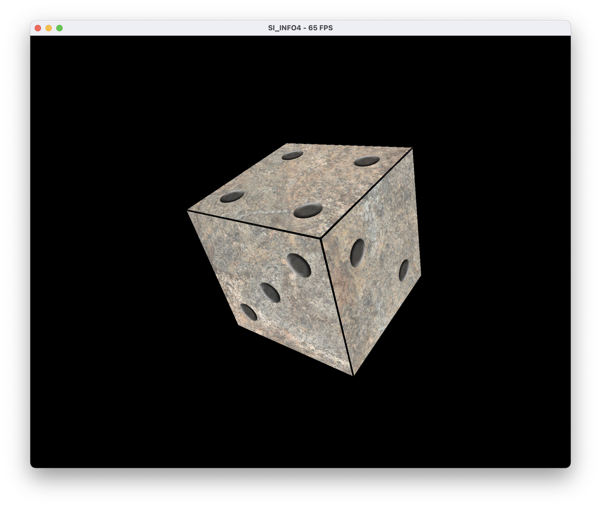

# TP6 - Textures

**Amad Salmon | Synthèse d’Image - Polytech Grenoble, INFO4, 2020-2021**

## Affichage de texture  

On modifie l’initialisation du programme `main.cpp` de façon à utiliser les coordonnées sphériques des positions des sommet pour afficher une texture. Le résultat est le suivant : 


## Coordonnées de texture

### Première version

Nous définissons les coordonnées de textures d'un cube dans la `main.cpp` dans la fonction `create_cube()`.  
Nous sélectionnons l'entièreté de la texture en positionnant les sommets de sélection en $(0, 0)$, $(0, 1)$,$(1, 0)$,$(1, 1)$, et l'appliquons à chacune de nos six faces en répétant six fois l'opération `output->texCoord.push_back` :

```c++
  output->texCoord.push_back(vec2(0.0, 0.0));
  output->texCoord.push_back(vec2(1, 0));
  output->texCoord.push_back(vec2(1, 1));
  output->texCoord.push_back(vec2(0.0, 1.0));

  output->texCoord.push_back(vec2(0.0, 0.0));
  output->texCoord.push_back(vec2(1, 0));
  output->texCoord.push_back(vec2(1, 1));
  output->texCoord.push_back(vec2(0.0, 1.0));

  output->texCoord.push_back(vec2(0.0, 0.0));
  output->texCoord.push_back(vec2(1, 0));
  output->texCoord.push_back(vec2(1, 1));
  output->texCoord.push_back(vec2(0.0, 1.0));

  output->texCoord.push_back(vec2(0.0, 0.0));
  output->texCoord.push_back(vec2(1, 0));
  output->texCoord.push_back(vec2(1, 1));
  output->texCoord.push_back(vec2(0.0, 1.0));

  output->texCoord.push_back(vec2(0.0, 0.0));
  output->texCoord.push_back(vec2(1, 0));
  output->texCoord.push_back(vec2(1, 1));
  output->texCoord.push_back(vec2(0.0, 1.0));

  output->texCoord.push_back(vec2(0.0, 0.0));
  output->texCoord.push_back(vec2(1, 0));
  output->texCoord.push_back(vec2(1, 1));
  output->texCoord.push_back(vec2(0.0, 1.0));
```

Cette technique de répétition des textures va de paire avec la texture "crate" où l'on souhaite donner l'impression que notre cube est une caisse en bois. Alors, il est intéressant d'appliquer la même texture à chacune de nos 6 faces :



<div style="page-break-after: always; break-after: page;"></div>

### Seconde version

Le résultat précédent a beau être divertissant, appliquer la même texture à chacune des faces n'est pas toujours très utile... Nous allons donc découper notre texture de manière à en afficher une partir distincte sur chacune des faces de notre cube.  Pour cela nous allons utiliser la texture "dice" afin de transformer notre cube en dé.  
Pour cela, nous découpons la texture en 6 carrés égaux selon les coordonnées suivantes :



Ce qui nous donne le code suivant dans `create_cube()` :  

```c++
  /* ******* Texture dé ******* */

  /* Face '4' */
  output->texCoord.push_back(vec2(0.0/4.0, 2.0/3.0));
  output->texCoord.push_back(vec2(1.0/4.0, 2.0/3.0));
  output->texCoord.push_back(vec2(1.0/4.0, 1.0/3.0));
  output->texCoord.push_back(vec2(0.0/4.0, 1.0/3.0));

  /* Face '2' */
  output->texCoord.push_back(vec2(1.0/4.0, 2.0/3.0));
  output->texCoord.push_back(vec2(2.0/4.0, 2.0/3.0));
  output->texCoord.push_back(vec2(2.0/4.0, 1.0/3.0));
  output->texCoord.push_back(vec2(1.0/4.0, 1.0/3.0));

  /* Face '3' */
  output->texCoord.push_back(vec2(2.0/4.0, 2.0/3.0));
  output->texCoord.push_back(vec2(3.0/4.0, 2.0/3.0));
  output->texCoord.push_back(vec2(3.0/4.0, 1.0/3.0));
  output->texCoord.push_back(vec2(2.0/4.0, 1.0/3.0));

  /* Face '5' */
  output->texCoord.push_back(vec2(3.0/4.0, 2.0/3.0));
  output->texCoord.push_back(vec2(4.0/4.0, 2.0/3.0));
  output->texCoord.push_back(vec2(4.0/4.0, 1.0/3.0));
  output->texCoord.push_back(vec2(3.0/4.0, 1.0/3.0));

  /* Face '1' */
  output->texCoord.push_back(vec2(2.0/4.0, 3.0/3.0));
  output->texCoord.push_back(vec2(3.0/4.0, 3.0/3.0));
  output->texCoord.push_back(vec2(3.0/4.0, 2.0/3.0));
  output->texCoord.push_back(vec2(2.0/4.0, 2.0/3.0));

  /* Face '6' */
  output->texCoord.push_back(vec2(2.0/4.0, 1.0/3.0));
  output->texCoord.push_back(vec2(3.0/4.0, 1.0/3.0));
  output->texCoord.push_back(vec2(3.0/4.0, 0.0/3.0));
  output->texCoord.push_back(vec2(2.0/4.0, 0.0/3.0));
```

Ainsi, on obtient en rendu un beau dé à 6 faces distinctes : 


