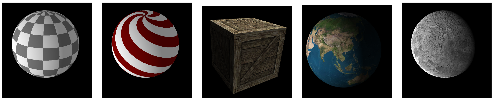

## Synthèse d’Image - Polytech Grenoble, INFO4, 2020-2021 

## TP6 - Textures



## Introduction
L’objectif du TP est d’apprendre à utiliser les textures en OpenGL. Nous allons utiliser des images pour texturer nos objets. L’avantage de cette technique est de permettre d’avoir des résultats beaucoup plus détaillés sans les sur-coûts dus à la création et à l’affichage d’une géométrie plus complexe.

La base de code fournie gère l’affichage d’un objet 3D non texturé. Si ce n'est pas déjà fait, placez cette base de code dans votre dossier ```TP3D``` contenant les TPs.

- accédez au dossier des TPs: ```cd ~/TP3D/```
- vérifiez que le répertoire `models`se trouve bien dans `TP3D`, dans le cas contraire reportez vous au sujet du TP1 pour récupérer ce répertoire contenant des modèles 3D.
- faites de même pour le répertoire `textures`.
- placez vous dans le répertoire TP6: ```cd TP6```
- installer un lien vers les répertoires `models` et `textures` situés dans le repertoire parent:

```
ln -sf ../models . ;
ln -sf ../textures .
```

- créez un dossier pour la compilation, accédez à ce dossier, lancez CMake, lancez la compilation
```
mkdir build ;
cd build ;
cmake .. ;
make 
```

Vous pouvez alors exécuter le programme:

```
./si_info4
```

### Affichage de texture

Dans le programme initial, vous observez une sphère colorée. Les couleurs des sommets sont calculées à partir des coordonnées de textures : vous pouvez observer que celles-ci varient continuement selon des coordonnées sphériques de la position du sommet. Ces coordonnées sont stockées dans un nouveau VBO, qui est déjà correctement créé et "bindé".

Afin d’utiliser ces coordonnées pour afficher une texture, il vous faut modifier l’initialisation du programme `C++`, de la manière suivante :

- Charger l'image: `QImage img("../textures/chessMulti.jpg");`
- Vérifier que l’image est bien chargée :
    ```
  if(img.isNull()) {
    std::cerr << "Error Loading Texture !" << std::endl; exit(EXIT_FAILURE);
  }
  ```
- Déclarer un identifiant : `GLuint textureID;`
- Allouer la texture sur le GPU : `glGenTextures(1, &textureID);`
- La définir comme texture courante : `glBindTexture(GL_TEXTURE_2D, textureID);`
- Définir des paramètres de filtre (nous reviendrons sur ces paramètres et leur signification au TP suivant) :
  ```
  glTexParameteri(GL_TEXTURE_2D, GL_TEXTURE_MAG_FILTER, GL_NEAREST);
  glTexParameteri(GL_TEXTURE_2D, GL_TEXTURE_MIN_FILTER, GL_NEAREST);
  glTexParameteri(GL_TEXTURE_2D, GL_TEXTURE_WRAP_S, GL_CLAMP_TO_EDGE);
  glTexParameteri(GL_TEXTURE_2D, GL_TEXTURE_WRAP_T, GL_CLAMP_TO_EDGE);
  ```
- Transmettre l’image au GPU :
  ```
  glTexImage2D(GL_TEXTURE_2D, 0,
    GL_RGBA32F,
    img.width(),
    img.height(), 0,
    GL_RGBA, GL_UNSIGNED_BYTE,
    (const GLvoid*) img.bits());
  ```
- Récupérer l’identifiant de la texture dans le shader : `GLuint texSamplerID = glGetUniformLocation( programID, "texSampler" );`
- Dans la boucle de rendu, lier l’unité de texture 0 avec la texture :
  ```
  glActiveTexture(GL_TEXTURE0);
  glBindTexture(GL_TEXTURE_2D, textureID);
  glUniform1i(texSamplerID, 0);
  ```
  - Puis à la fin du programme, il faut détruire la texture : `glDeleteTextures(1, &textureID);`
  - Dans le fragment shader, il suffit de récupérer la couleur de la texture: `frag_color = texture( texSampler, vert_texCoord);`

### Coordonnées de texture

Avant d’utiliser une texture sur un maillage, il faut créer des coordonnées de texture. Dans le cours nous avons expliqué comment ces coordonnées de texture permettent de plaquer l'image de texture sur le maillage.
Dans le cas d’une sphère on peut, comme c'est fait dans la fonction `create_sphere`, utiliser les composantes angulaires des coordonnées sphériques pour définir les coordonnées de textures. Trouvez une ou plusieurs manières de définir les coordonnées de textures d’un cube. Pour ceci, ajoutez les dans la fonction `create_cube`.

### Bonus

Les textures ne servent pas uniquement à définir la couleur des fragment : elles peuvent représenter n’importe quel facteur utilisé dans l’équation de l’éclairage (cf. TP 4). Utilisez une texture pour représenter une autre caractéristique de la surface.


